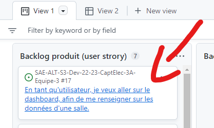
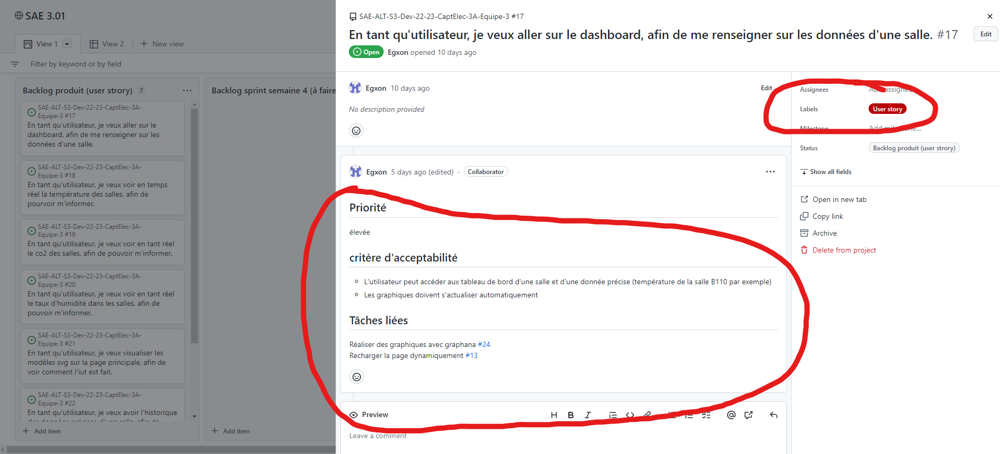

# SAE-ALT-S3-Dev-22-23-CaptElec-3A-Equipe-3

## Equipe
- Egxon Zejnullahi (Scrum master + dev backend)
- Thomas Testa (Dev front-end et back-end)
- Marco Valle Wellmer ( dev front-end et back-end)

## Technologie utilisées:
- Python
- MySQL
- PHP
- JavaScript
- Docker
- HTML/CSS
- Graphana

## Lien vers le backlog produit
Cliquez ici --> [BackLogs produits](https://github.com/users/SkyFriz/projects/2).

Quand vous cliquez sur les Backlogs produits, pour voir les prioritées, critères d'acception et tâche reliées cliqué sur le user story

Ensuite vous aurez toutes les informations 

## Lien vers les backlogs sprints
Cliquez ici --> [BackLogs Sprints](https://github.com/users/SkyFriz/projects/2).

## Documentation
| Nom           | Lien        |
|---------------|-------------|
| Installer ptyhon sur windows ou ubuntu| https://github.com/SkyFriz/SAE-ALT-S3-Dev-22-23-CaptElec-3A-Equipe-3/blob/main/DocTechnique/InstallerPython.adoc |
|  Script python pour flux mqtt + BD      | https://github.com/SkyFriz/SAE-ALT-S3-Dev-22-23-CaptElec-3A-Equipe-3/blob/main/mqtt.py        |
|  Doc utilisateur pour le script mqtt|https://github.com/SkyFriz/SAE-ALT-S3-Dev-22-23-CaptElec-3A-Equipe-3/blob/main/DocUtilisateur/Document_utilisateur_scriptPython.adoc  |
|  Doc technique pour le script mqtt| https://github.com/SkyFriz/SAE-ALT-S3-Dev-22-23-CaptElec-3A-Equipe-3/blob/main/DocTechnique/Documment_technique_scriptPy.adoc|
|  Test du script mqtt| https://github.com/SkyFriz/SAE-ALT-S3-Dev-22-23-CaptElec-3A-Equipe-3/tree/main/Cahier_De_Test |
|Doc utilisateur du site web | https://github.com/SkyFriz/SAE-ALT-S3-Dev-22-23-CaptElec-3A-Equipe-3/blob/main/DocUtilisateur/SAE.pdf |
| | |
| | |

## Release Sprint 
| Nom           | Lien        |
|---------------|-------------|
|Lien du site| Le site n'était pas hébérgé durant le 1er sprint|
|Lien local |https://github.com/SkyFriz/SAE-ALT-S3-Dev-22-23-CaptElec-3A-Equipe-3/tree/main/SiteWeb/captelec-master |

## Release Sprint 2
| Nom           | Lien        |
|---------------|-------------|
|Lien du site| http://51.38.52.224/connexionTest.php |
|Lien local |https://github.com/SkyFriz/SAE-ALT-S3-Dev-22-23-CaptElec-3A-Equipe-3/tree/main/SiteWeb/captelec-master |

## Sprint review semaine 3

Durant cette semaine, nous avons travaillé sur du Python, PHP, JavaScript, Graphana , MySQL et Docker. Nous avons réussi à:

- Développer un script python qui récupère les données des salles via le flux mqtt et les stocker dans une base de données.

- Utiliser Grafana pour créer des tableaux de bord pour visualiser les données collectées, en utilisant des variables pour permettre aux utilisateurs de sélectionner les données qu'ils souhaitent voir.

- Reprendre le site de base et le modifier pour pouvoir séléctionner les données que l'utilisateur souhaite voir par rapport aux salles de l'IUT.

- Créer un serveur websocket qui permet d'avoir les données les plus récentes de la base de données MySQL qu'on à configuré.

- Setup de graphana pour l'affichage de certains graphiques.

- Plusieures requêtes liées aux graphiques graphana.

Les défis rencontrés au cours de ce sprint ont été l'intégration des différents outils: Python, Grafana, PHP. L'équipe a dû travailler pour s'assurer que toutes les parties de l'application fonctionnent ensemble de manière transparente.

Au niveau organisationel : 

- Egxon c'est occupé a gérer github (scrum master) et a réaliser le script python qui récupère les données pour ensuite les envoyées dans la base de donnée mysql, et a crée des graphiques avec graphana 

- Marco a crée la base de donnée, crée des script ....

- Thomas a réalisé le début du site et son fonctionnement

Au prochain Sprint, l'équipe prévoit de :

Implémenter les tableaux de bord graphana sur le site web dynamiquement. On prévoit de crée des menus déroulant ou l'utilisateur pourra choisir la source (température, co2, humidité, etc...) et la plage de temps, par exmemple les dernieres 24 heures, les 2 derniers jours, etc ... Ensuite, on prévoit de réaliser la tâche principal ou la couleur des salles sur le svg change de couleur en fonction de la donnée choisi et de sa valeur. On prévoit donc la finalisation du projet.

## Sprint Review semaine 4

Durant ce dernier sprint, nous avons finalisé notre site en :

- implémentent les couleurs des salles en fonctions de la témpérature.

- Créant une table dans notre base de donnée pour les batteries AM-107.

- En ajoutant les données des batteries AM-107 à notre table en modifant le script mqtt.py.

- implémentent les graphiques (des salles et des valeurs, des pourcentages de bateries des appareils AM-107).

- Améliorer le design du site.

- Ajoutant une page de contact.

- Créant un script JavaScript pour les couleurs des salles pour que ce dernier soit dynamique.

- Créant la navaigation de bâtiment en bâtiment .

- En donnant le choix a l'utilisateur pour les salles, données et plages de temps pour les graphiques.

Au niveau organisationel : 

- Egxon s'est occupé a remplir le github, a modifié le script javascript (client websocket crée par marco) pour pouvoir actualiser les couleurs des salles en temps réel avec l'aide de thomas, a réglé les problèmes des graphiques sur graphana en créant de nouvelles requêtes SQL, a crée les liens pour avoir les bons graphiques réliée aux bonnes salles.

- Thomas s'est occupé du design du site, de la création des pages "Graphique", "Contact" et "Connexion". Documentation Utilisateur et Technique. 

- Marco s'est occupé

## Livrable : 
Notre site final : http://51.38.52.224/connexionTest.php

------------------
## Commentaires 

Documentations :  attention, un script python n'est pas une doc ! il faut une doc technique et une doc utilisateur.

Tests :  je n'ai pas de cahier de test (cf. SAE S2)

Backlog produit :  revoir la vidéo je n'ai que l'intitulé de la US, il me manque les critères d'acceptabilité, les tâches liées, la priorité, le label US.

Backlog sprint :  il reste encore de nombreuses issues dans "à faire" alors que le sprint est terminé ... 

Je n'ai pas de release de sprint

CR :  j'ai un CR technique mais j'ai rien sur l'organisationnel ...

Seulement 12 commits sous Github ??

