= Documentation Utilisateur
:autor: Théo CHAVES
:autor2: William TOUZANI
:groupe: 1A
:email: theo.chaves@etu.univ-tlse2.fr
:email2: william.touzani@etu.univ-tlse2.fr
:toc: macro
:toc-title: Table des matières
:toclevels: 4
:sectnums:

'''

Par :

{autor} {groupe} {email} +

en collaboration avec :

{autor2} {groupe} {email2}

'''

<<<

toc::[Title="Table des matières"]

<<<

== Intro

Notre projet est une réponse de la part de l'IRIT à l'appel d'offre de LaRegion : une preuve de concept visant à observer la consommation électrique de l'IUT de Blagnac. Nous devions donc créer un tableau de bord web sécurisé, répertoriant un menu des bâtiments, étages et salles de l'établissement à sélectionner pour ensuite ouvrir un panel de graphiques concernant une salle en particulier sur Grafana. 

== Navigation globale du site

.Shéma Navigationnel d'Interface du site

Cette figure représente l'aborescence navigationnelle du site captelec. Nous pouvons remarquer que notre tableau de bord est séparé en trois parties : une authentification, un menu des bâtiments/étages/salles codés en php, et une représentation graphique des données captées/simulées sur grafana.

Lorsque nous sommes identifiés, nous arrivons sur une page représentant le menu des bâtiments. Nous avons le choix entre changer les paramètres, nous déconnecter ou naviguer. Lorsque nous cliquons sur un bâtiment, nous nous retrouvons sur le menu des étages de ce bâtiment. Nous pouvons alors choisir un étage. Lorsque nous choisissons un étage, nous arrivons sur le menu des salles de l'étage sélectionné, où nous pouvons choisir une salle pour soit obtenir des détails graphiques de sa consommation, soit obtenir un volet d'informations sur la salle.

== L'authentification 

Lorsque nous lançons http://captelec.iut-blagnac.fr, nous arrivons sur une page d'identification, permettant la sécurité des données captées des salles : 

.Page d'authentification de captelec
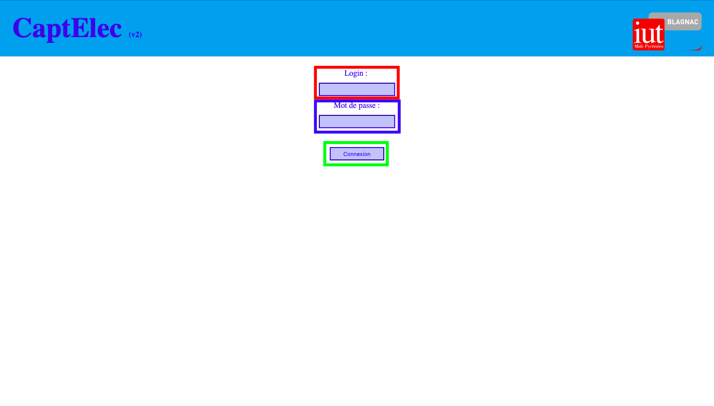

Cette page possède une zone de texte "Login" (encadrée en rouge) dans laquelle nous pouvons entrer le login, une autre zone de texte (encadrée en bleu) dans laquelle nous pouvons entrer le mot de passe et un bouton "Connexion" (encadré en vert), nous permettant de nous connecter si les logins sont corrects.

Lorsque nous cliquons sur "Connexion", la page nous redirigera sur le menu des bâtiments, étages et salles. Cependant si nous nous connectons avec des logins incorrects, la connexion nous est alors refusée et nous serons redirigés sur cette même page d'authentification avec un message d'erreur (encadré en noir ci-dessous) : 

.Page d'authentification de captelec en entrant des identifiants incorrects
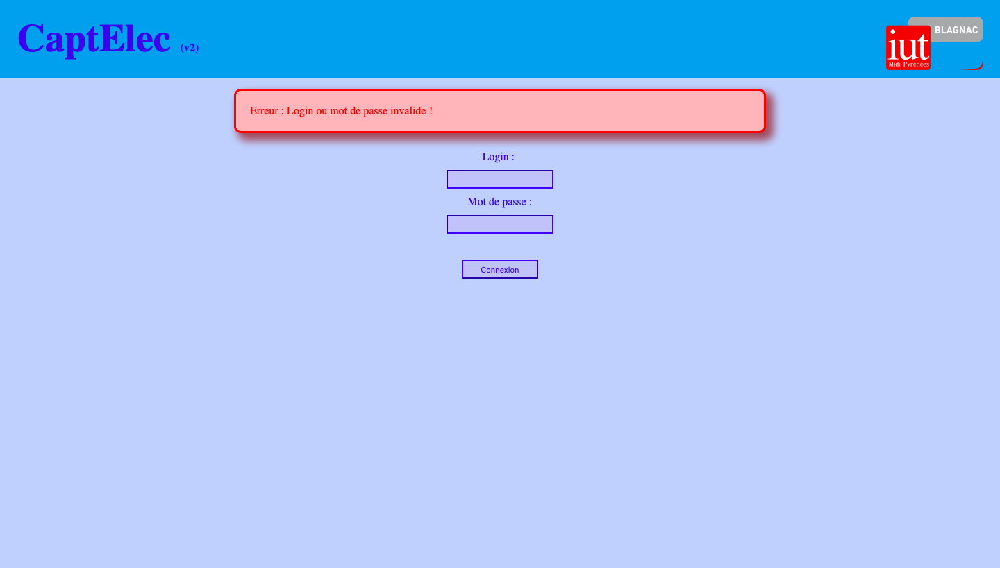

== Le menu des bâtiments, étages, et salles :

.Onglet de première arrivée sur captelec après l'authentification
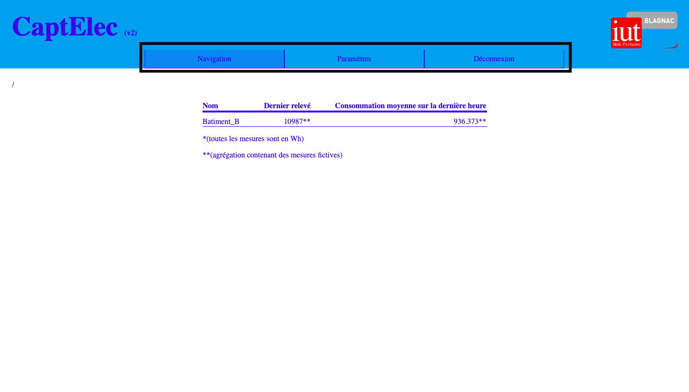

Nous arrivons sur cette page après la connexion. Dans l'entête du site (encadrée en noir), nous pouvons remarquer un menu composé de trois onglets : 

* Navigation permettant de naviguer dans les bâtiments, étages et salles
* Paramètres permettant de changer le mode de navigation et la couleur du thème
* Déconnexion nous permettant de nous déconnecter

=== Navigation par Tableaux

.Onglet de Navigation par tableaux : menu des bâtiments
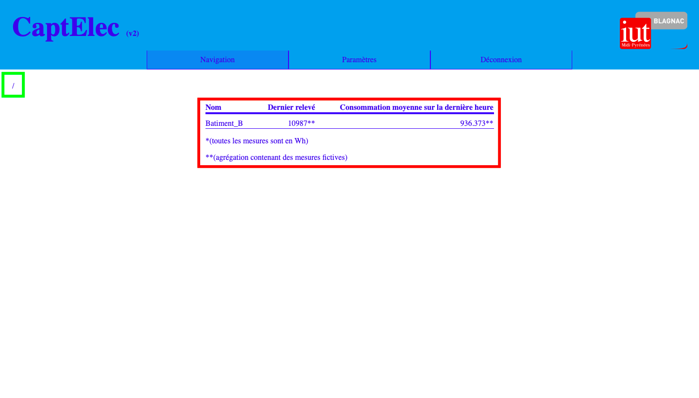

Cette page représente l'onglet navigation, soit ici un menu des bâtiments (encadré en rouge). Ce menu contient trois colonnes (comme tous les autres) :

* Les noms des bâtiments 
* Les derniers relevés des consommations des bâtiments (en Watt) 
* La consommation moyenne sur la dernière heure des bâtiments 

Nous pouvons observer qu'il y a un "/" en haut à gauche du tableau (encadré en vert). Celui-ci représente le "répertoire" des menus : le "/" montre que nous sommes à la racine de l'arborescence des menus.

Nous pouvons observer les colonnes "Dernier Relevé" et "Consommation moyenne sur la dernière heure" (dans l'encadré rouge). Celles-ci représentent le dernier relevé de la consommation totale du bâtiment correspondant, et sa consommation moyenne sur la dernière heure. Ces données sont bordées d'astérisques : ces données sont donc en Watt. Si ces données en contiennent deux, cela veut dire que certaines données sont simulées donc fictives (dans le cas d'un bâtiment ou d'un étage).

Nous pouvons aussi remarquer qu'il n'y a qu'un seul bâtiment dans le menu des bâtiments : nous avons préféré simuler uniquement les données du bâtiment B. Lorsque nous cliquons sur Bâtiment B : +

.Menu des étages du bâtiments B sous format tableaux
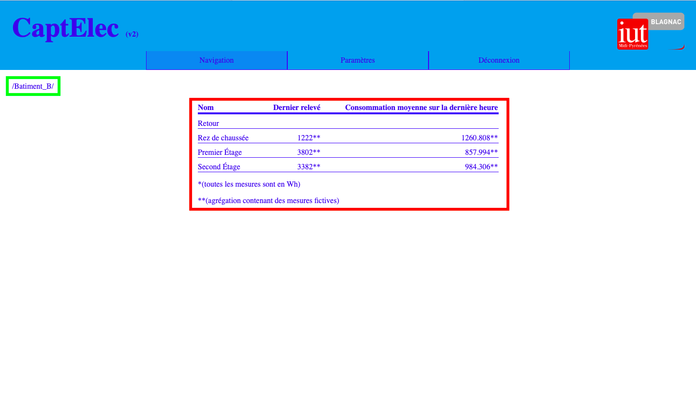 

Nous arrivons sur le menu des étages du bâtiment sélectionné (ici le bâtiment B comme montré par le chemin de l'aborescence en haut à gauche du tableau, encadré en vert). Nous avons le choix dans notre menu (encadré en rouge) entre le "Rez de Chaussée", "Premier étage", "Second étage" (les étages réels du bâtiment) ainsi qu'une case "Retour" nous permettant de revenir au menu des bâtiments. Nous remarquons aussi que les colonnes "Dernier Relevé" et "Consommation moyenne sur la dernière heure" pour chaque étage ont changé de valeurs : elles correspondent aux valeurs de consommation de chaque étage correspondant.

Si nous cliquons sur "Rez de Chaussée", nous aurons accès au menu de toutes les salles du rez de chaussée du bâtiment B (département informatique) contenant des ordinateurs, si nous cliquons sur "Premier Etage", nous aurons accès au menu de toutes les salles du premier étage du département informatique du bâtiment B, et si nous cliquons sur "Second Etage", nous aurons accès à toutes les salles du dernier étage du département informatique du bâtiment B.

Cliquons maintenant sur "Premier Etage" comme exemple : 

.Menu des salles du premier étages du bâtiment B sous format tableaux
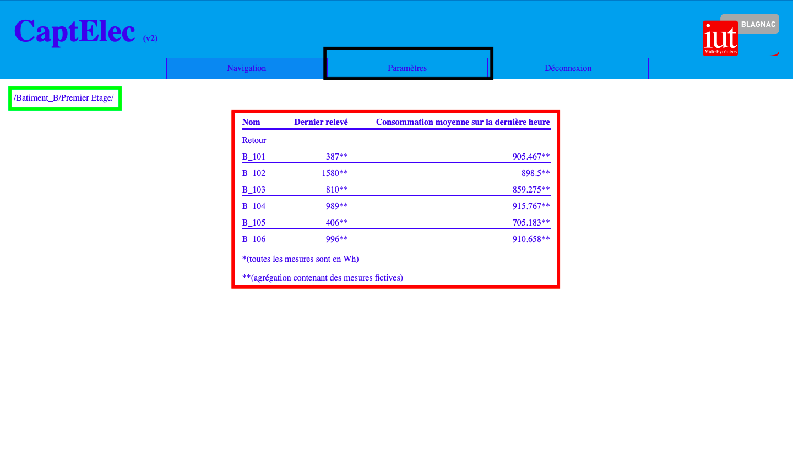

Nous arrivons sur cette page et remarquons instantanément le changement du chemin de l'arborescence qui passe de "/Bâtiment_B/" à "/Bâtiment_B/Premier Etage/" (encadré en vert). +
Nous remarquons aussi que le tableau (encadré en rouge) contient maintenant toutes les salles contenant des ordinateurs du premier étage du département informatique du bâtiment B. Les colonnes "Dernier Relevé" et "Consommation moyenne sur la dernière heure" représentent maintenant les valeurs de consommation des salles correspondantes. Le bouton "Retour" permet de revenir à la page précédente (menu des différents étages du bâtiment).

Si nous cliquons sur "B_101", la page ouvrira les graphiques sur le site de Grafana, permettant la visualisation des données de consommation électrique de la salle B_101. C'est la même chose pour les toutes les autres salles présente dans le menu : la page ouvrira les graphiques du site de Grafana des données de la consommation électrique des salles attribuées. 

Avant de cliquer sur une salle, cliquons d'abord sur "Paramètres" dans l'entête du site (encadré en noir) : 

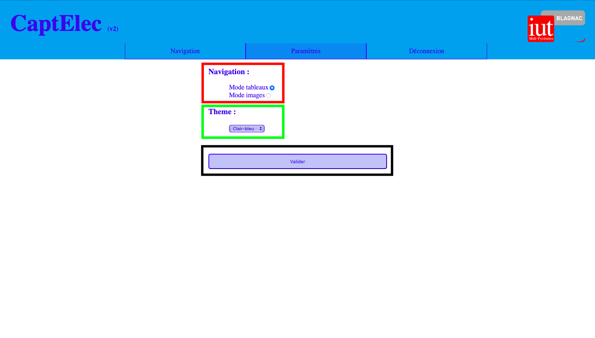

Comme expliqué précédemment, Paramètres nous permet de changer le mode navigation en tableaux ou en images (encadré en rouge) grâce à des boutons, et de changer les couleurs du thème (encadré en vert). Lorsque nous avons choisi son mode de navigation et son thème, nous pouvons cliquer sur le bouton "Valider" (encadré en noir) pour valider nos choix.

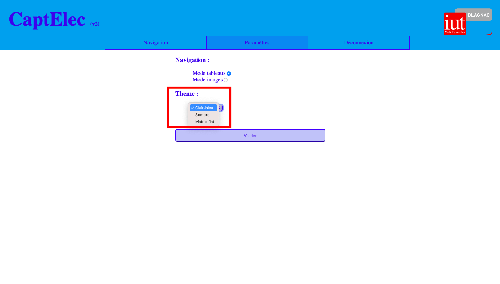

Lorsque nous cliquons sur le menu déroulant des thèmes (encadré en rouge), nous en voyons trois différents : 

* Le mode clair-bleu, le thème actuel, coché par-défaut 
* Le mode Sombre, un thème plus sombre
* Le mode Matrix-flat, un autre thème sombre

Lorsque nous cliquons sur Valider, la couleur et le thème changent, nous pouvons donc recliquer sur Navigation pour observer le résultat : 

.Paramètres lorsque nous changons les couleurs (ici mode Sombre)
image::ParamSombre.png[]

.Vue regroupant tous les modes dans tous les thèmes d'affichage
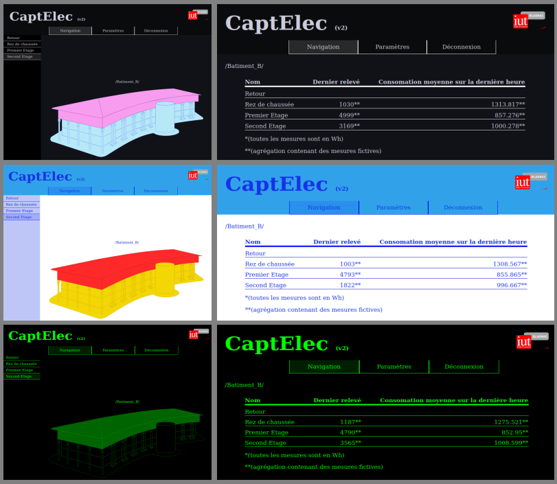

=== Navigation par Images :

.Menu des bâtiments en mode images
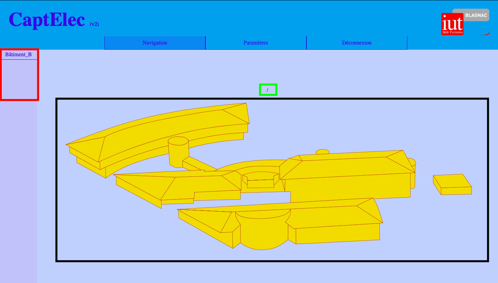

Lorsque nous nous mettons en mode de navigation "Images", Nous arrivons sur cette page. Nous pouvons y voir un plan 3D de l'IUT (encadré en noir) comprenant tous les bâtiments (correspondant au menu des bâtiments). Nous pouvons observer à gauche un menu de navigation (encadré en rouge) avec les noms de bâtiments. +
Ici, seul le bâtiment B est affiché car comme pour le mode tableau, le bâtiment B est l'unique bâtiment représenté pour cette preuve de concept. +
Nous remarquons aussi la présence d'un "/" (encadré en vert) au-dessus du plan. Celui-ci représente le "répertoire" des menus : le "/" montre que nous sommes à la racine de l'arborescence des menus comme pour les tableaux. +
Si nous survolons avec notre souris le bâtiment B, celui-ci se rougit sur l'image, et se grise sur le tableau à notre droite. +
À l'inverse, si nous sélectionnons le bâtiment sur le tableau, celui-ci se grise et se rougit sur le dessin. Cela nous permet une navigation plus rapide si nous ne connaissons pas son nom ou son emplacement. +

.Menu des bâtiments si nous survolons le bâtiment B avec notre souris
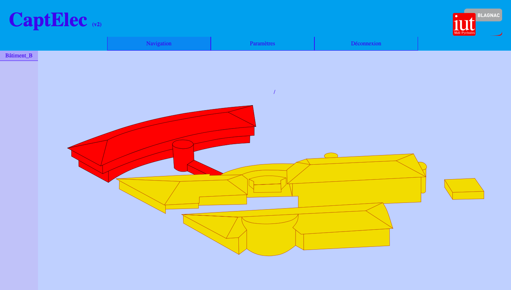

Cliquons maintenant sur un bâtiment, ici, le bâtiment B.

.Menu des étages du bâtiment B en mode images
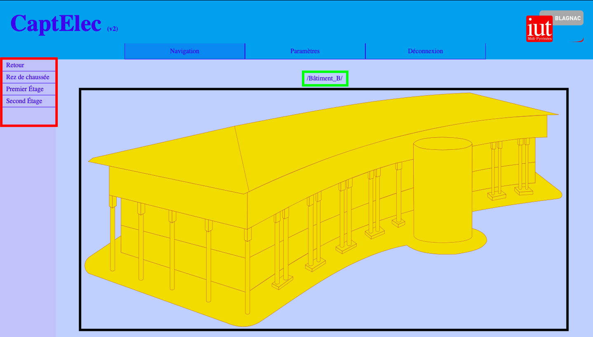

Nous arrivons ensuite sur le menu des étages, avec un plan 3D du bâtiment sélectionné (encadré en noir). 
Nous pouvons remarquer le changement du répertoire "/Bâtiment_B" (encadré en vert) nous montrant que nous nous situons dans le bâtiment B. +
Nous pouvons aussi remarquer que le menu à gauche (encadré en rouge) affiche maintenant les différents étages du bâtiment (Rez de chaussée, Premier Étage et Second Étage), avec un bouton retour pour retourner sur la sélection des bâtiments.
Comme pour les bâtiments précédemment, si nous passons la souris sur un étage du bâtiment, celui-ci rougit sur le plan et se grise dans le menu, et à l'inverse, si nous sélectionnons un étage sur le tableau, celui-ci se grise et se rougit sur le dessin, ce qui nous permet une navigation plus rapide.

.Menu des étages du bâtiment B si nous survolons le premier étage avec notre souris
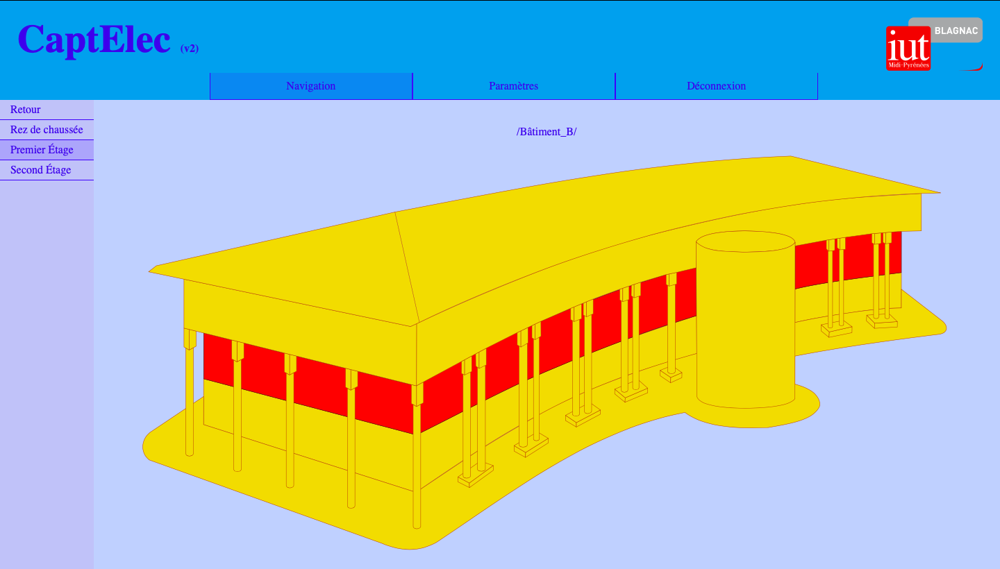

Si nous cliquons sur le rez de chaussée, nous aurons accès au plan des salles du rez de chaussée, pour lepremier étage, au plan des salles du premier étage et pour le second étage, au plan des salles du second étage.

Cliquons donc sur le premier Étage.

.Menu des salles du premier étage du bâtiment B en mode images
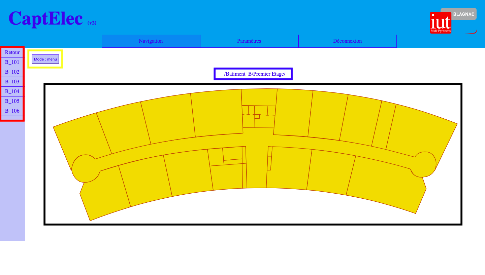

Nous arrivons ensuite sur le menu des salles, avec un plan 2D de l'étage sélectionné (encadré en noir). +
Nous pouvons remarquer (encadré en bleu) le changement du répertoire "/Bâtiment_B/Premier Étage" nous montrant que nous nous situons dans le premier étage du bâtiment B. +
Nous pouvons aussi remarquer que le menu à gauche (encadré en rouge) affiche maintenant les différentes salles de l'étage (ici B101, B102, B103, B104, B105 et B106), avec un bouton retour pour retourner sur la sélection des étages. +
Un bouton "Mode" (encadré en jaune) est aussi présent en haut à gauche du plan. Nous voyons que nous sommes en mode "menu". Si nous cliquons dessus, nous passerons en mode data : 

.Menu des salles du premier étage du bâtiment B (images) en mode data
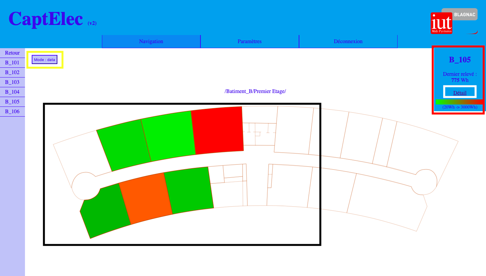

Nous remarquons que le bouton "mode" en haut à droite (toujours encadré en jaune) est passé en data.
Cela nous permet d'observer directement le dernier relevé d'une salle (en haut à droite, encadré en rouge) lorsque nous y cliquons dessus (ici, nous avons cliqué sur la salle B_105). Dans ce même encadré, nous y voyons un gradué de couleurs faisant office de légende. +
Ces couleurs, du vert (pour une faible consommation, 20W) au rouge (pour une forte consommation 3000W) nous permettent de savoir si une salle consomme beaucoup d'électricité, ou si sa consommation est anormale. +
Nous les voyons sur le plan des salles (encadré en noir) au milieu de l'écran. Dans ce plan, les salles contenant des données de consommation électrique uniquement s'affichent en couleur. +
Nous pouvons aussi remarquer dans l'encadré rouge un lien cliquable "détails" (encadré en blanc). Celui-ci nous permet de rediriger vers une page Grafana composées de graphique des relevés de consommation de la salle sélectionnée.

Maintenant, revenons à la navigation de base en recliquant sur ce bouton "Mode". +

.Menu des salles du premier étage du bâtiment B en mode images
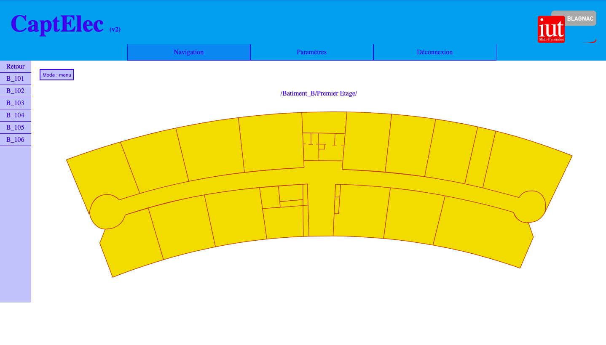

Comme pour les étages et les bâtiments précédemment, si nous passons la souris sur une salle du plan (toujours encadré en noir) : 

.Menu des salles du premier étage du bâtiment B en mode images lorsque nous survolons la salle B104
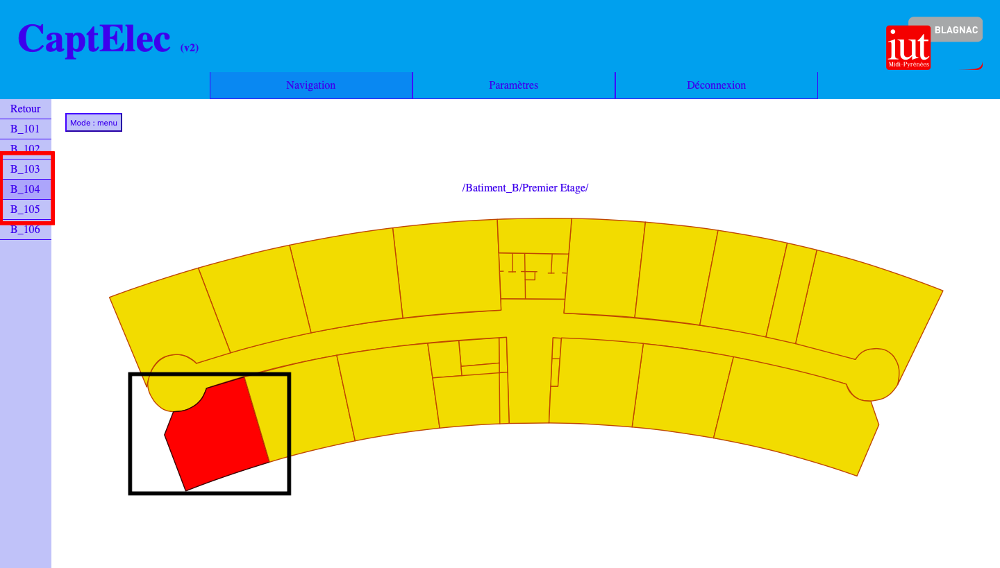

celle-ci rougit sur le plan (encadrée en noir) et se grise dans le menu (encadrée en rouge), et à l'inverse, si nous sélectionnons une salle sur le tableau, celle-ci se grise et se rougit sur le dessin, ce qui nous permet une navigation plus rapide.

Si nous cliquons sur une salle, le site (comme le lien "Détails" en mode Data précédemment) nous redirigera vers une page Grafana composées des graphiques des relevés de consommation de la salle sélectionnée. Prenons pour exemple la salle B_104 :

== Visualisation des graphiques de données sur Grafana

Nous arrivons donc sur une page d'authentification Grafana, afin de sécuriser nos données : 

.Page d'authentification de Grafana
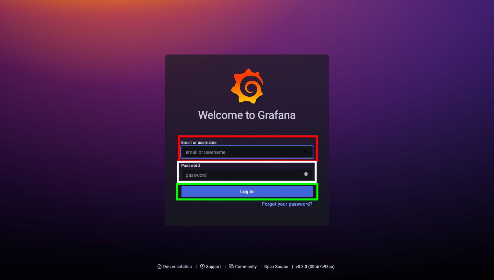

Nous avons deux zones de texte : une permettant d'entrer notre nom d'utilisateur (encadrée en rouge), et l'autre le mot de passe (en blanc). Le bouton "Login" nous permet de se connecter.

.Page d'authentification de Grafana lorsque nous entrons de mauvais identifiants
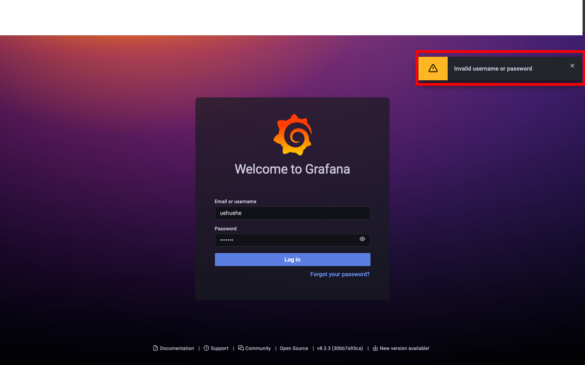

Si nous faisons erreur sur l'identification, un pop-up d'erreur apparaît (encadré en rouge).

Une fois correctement connectés, nous n'aurons plus besoin de se reconnecter par la suite. Nous arrivons donc sur la page des graphiques de consommation de la salle sélectionnée.

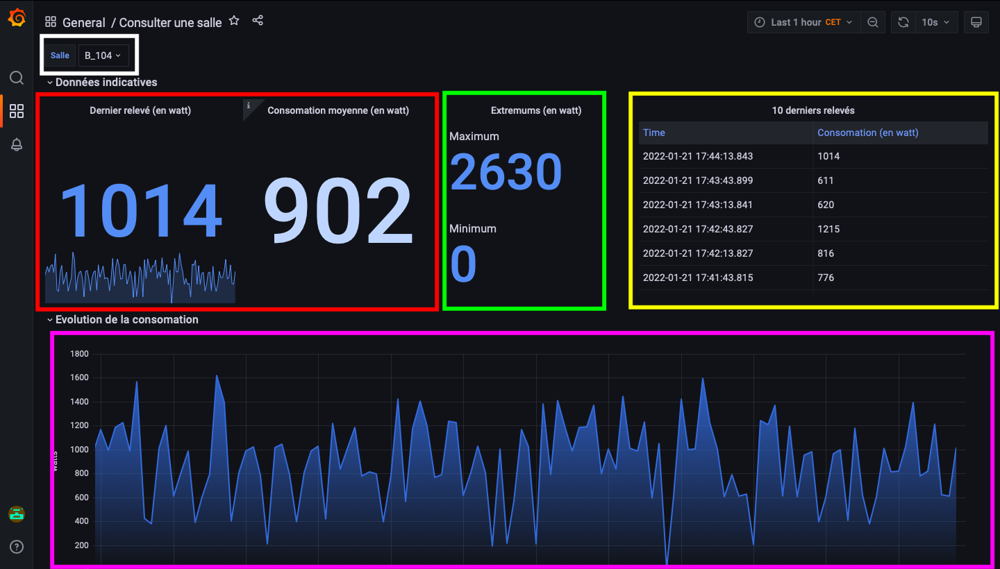

Nous arrivons donc sur une page comme celle-ci. Nous pouvons voir que de nombreuses données sont présentes sur cette page. 

Nous pouvons voir en haut de la page un petit menu déroulant (encadré en blanc) permettant de choisir quelle salle nous voulons analyser sans avoir besoin de retourner sur l'interface précédente. + 
Ce menu déroulant permet de voir toutes les salles quel que soit l'étage ou le bâtiment. + 

Nous pouvons observer aussi toutes les données simulées de la salle, comme le dernier relevé de consommation ou la consommation électrique moyenne données en Watt (encadrés en rouge). Les valeurs maximum et minimum des relevés de consommation (de la B104 ici) sont aussi gardés à droite de la consommation moyenne de la salle (encadré en vert). 

Nous pouvons remarquer la présence d'un historique des dix derniers relevés dans un tableau en haut à droite de la page (encadré en jaune), illustrant la consommation électrique en Watt à une date précise (au millième de seconde près).

Pour ce qui est de la partie du bas de l'écran, nous remarquons un graphique des données simulées de la salle B104 (encadré en rose). Cette courbe représente la consommation électrique de la salle en fonction du temps, avec une courbe bleu-foncé représentant les valeurs en Watt de la consommation de la salle en temps réel.

*Nota Bene :*

* La plupart de ces valeurs sont des données simulées donc fictives. Uniquement la salle B229 contient des données captées. Les valeurs des données simulées utilisées sont inspirées de vraies valeurs de consommation d'ordinateur donc elles ne devraient que très peu changer. Cependant, elles risquent de moins varier. La courbe aura moins de fluctuation étant donné que les élèves resteront plus longtemps sur les ordinateurs simultanément.

* Les graphiques Grafana sont très nombreux. Nous aurions pu en utiliser de nombreux autres qui restent vraiment intéressants pour ce projet. Nous expliquerons en détails ceux que nous pensons les plus utiles et enrichissant (Timeline de l'historique, diagramme baton...) ainsi que la manière dont vous pourrez personnaliser ces graphiques dans la prochaine version du projet.

== Se déconnecter

Si nous revenons sur la navigation de notre site, nous pouvons donc nous déconnecter en cliquant sur le bouton déconnecter (encadré en rouge) à la droite dans notre entête.

.Menu des bâtiments en mode image
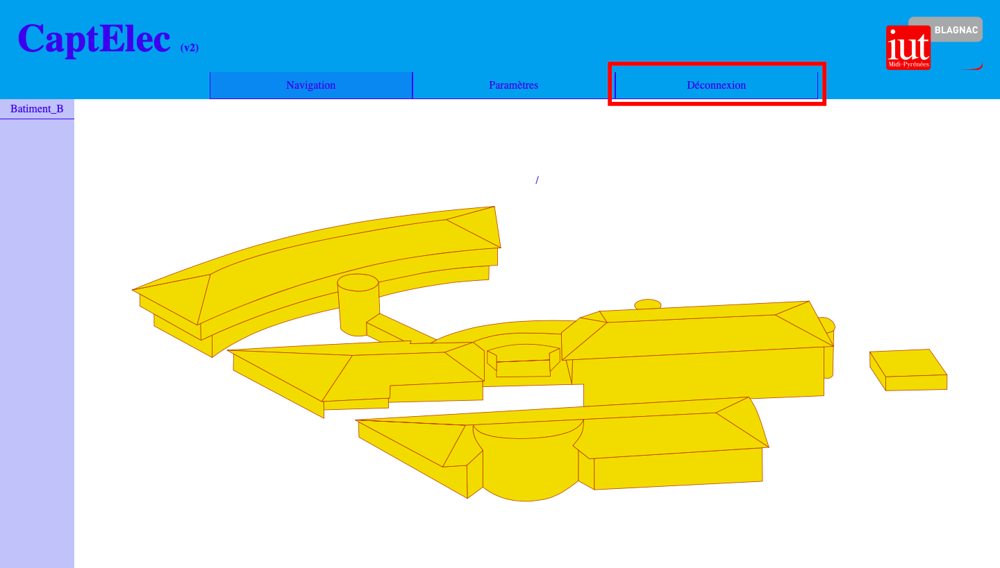

Nous revenons donc sur la page d'authentification : 

.Page d'authentification de base après la déconnexion
image::authentificationVierge.png[]

