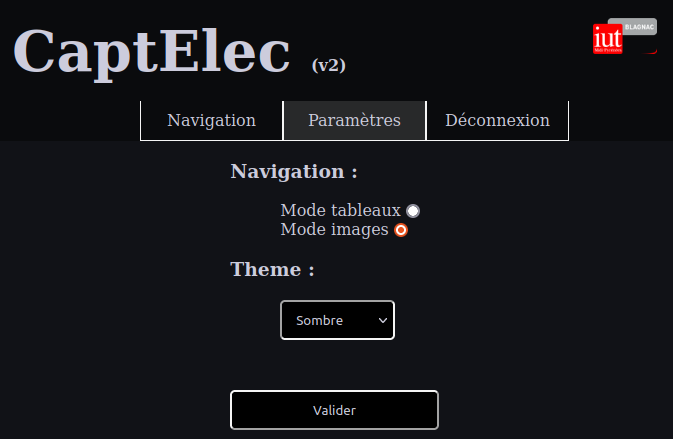
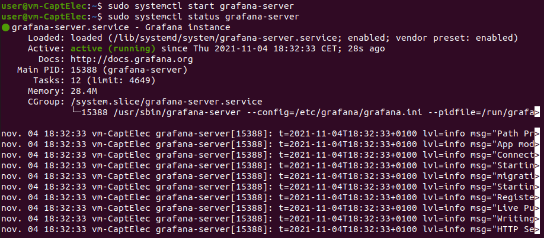
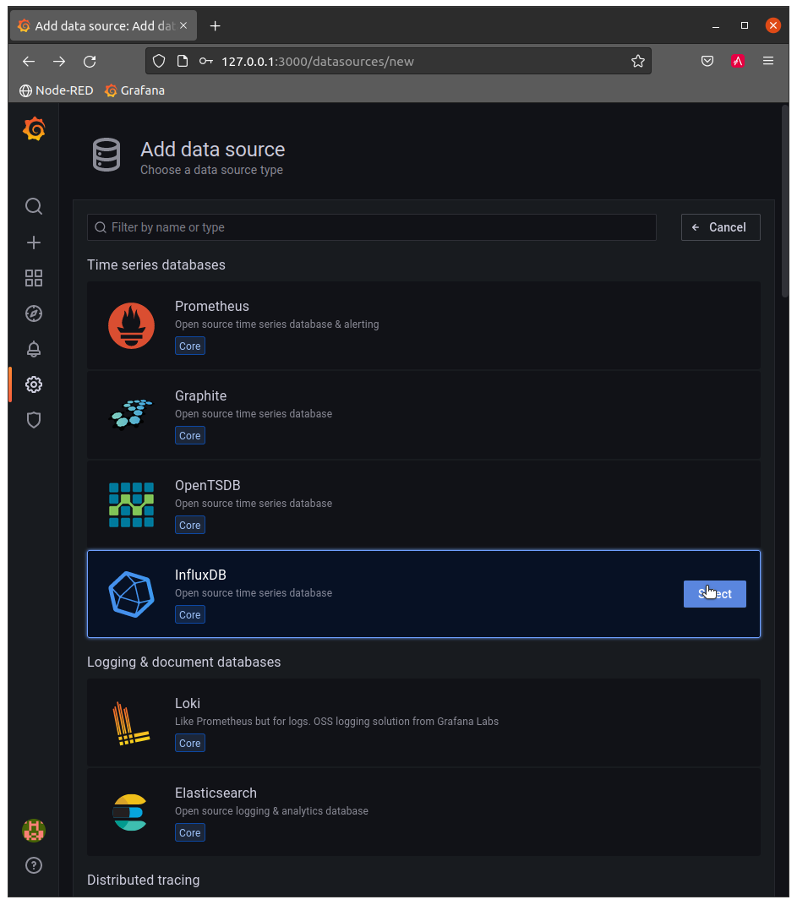

= Documentation Technique
//acorriger
:autor: Axel Bacrie
:groupe: 1A
:email: axel.bacrie@etu.univ-tlse2.fr
:corrector: Théo Chaves
:email2: theo.chaves@etu.univ-tlse2.fr
:toc: macro
:toc-title: Table des matières
:toclevels: 6
:sectnums:
:sectnumlevels: 6

'''

Par {autor} {groupe} {email} et {corrector} {groupe} {email2} (correcteur) +

'''

<<<

toc::[Title="Table des matières"]

<<<

//=============================================================================//
//=============================================================================//
//                              Introduction                                   //
//=============================================================================//
//=============================================================================//

== Introduction
//acorriger
Cette documentation a plusieurs objectifs :

* Permettre le dépoiement de l'application
+
====
Voir : <<Mise en place du serveur>>, <<Structure du site>>
====
+
* Permettre de comprendre la structure de l'application
+
====
Voir : <<structureApp,Structure de l'application>>, <<structureSite>>
====
+
* Permettre la modification de l'existant 
** Modifier les processus du site
+
====
Voir : <<menus>>, <<auth>>, <<param>>
====
+
** Étendre les processus existants sans ajout de fonctionnalité
+
====
Voir : <<config>>, <<newSVG>>
====
+
* Permettre l'extension future de l'application et du site (ajout de fonctionalités).

[NOTE]
Ce que nous appellerons __"Le Site"__ est la partie web du projet (plus de détails <<defSite,ici>>).

//=============================================================================//
//=============================================================================//
//                                   Structure                                 //
//=============================================================================//
//=============================================================================//

== Structure et fonctionnement

[[structureApp]]
=== Structure de l'application

Afin de correctement décrire ce projet, nous pouvons le découper en trois grandes parties. Nous retrouvons ces trois parties dans le schéma des technologies ci-dessous (trois lignes). Nous regrouperons donc les technologies et les tâches à réaliser dans ces trois catégories.

* *Acquisition* : <<Capteur>>, <<LoRaWAN>>
* *Stockage* : <<Node-Red>>, <<InfluxDB>>
* *Affichage / Interprétation* : <<PHP>>, <<Apache>>, <<Grafana>>

Ici, nous constatons que le <<MQTT>> n'est pas vraiment classable entre Acquisition et Stockage puisque par sa nature de protocole de communication, c'est une technologie de "transition".

Nous pouvons apporter un peu plus de détails quant aux rôles de ces différentes parties.

* *Acquisition* : Récupérer les données (consommation électrique) "sur le terrain" pour les rendre disponibles sur le réseau de l'IUT.
* *Stockage* : Lire les données envoyées sur le réseau et les insérer dans une base de données.
* *Affichage / Interprétation* : Collecter les données dans la base pour les présenter sous différentes formes et les présenter à l'utilisateur.

[NOTE]
"Interprétation" fait référence à des traitements faits sur les données et qui déclencheraient des actions en fonction.

.Schéma de répartition des technologies dans l'application

[[defSite]]
[NOTE]
Ce que nous appelerons __"Le Site"__ dans cette documentation fait référence à la partie "Serveur Web" sur l'image ci-dessus.

==== Point sur les technologies

[[Capteur]]
===== Capteur Electrique (NKE TRIPHAS'O 60A)

Le capteur Triphas’O permet la télé relève à distance via le réseau LoRaWAN®, des consommations d’énergies électriques d’une installation. Il est spécialement conçu pour répondre aux besoins de gestion d’énergie des bâtiments industriels, tertiaires, fonctionnant avec des équipements de moyenne et forte puissance et de forte consommation d’énergie.
C'est pour ces raisons que ce capteur convient tout à fait à l'utilisation contrôle à distance d'une salle informatique.

===== LoRaWAN

La spécification LoRaWAN est un protocole de télécommunication LPWA (Low Power, Wide Area) conçu pour connecter sans fil des "objets" fonctionnant sur batterie et permettant de se connecter et de se connecter à Internet via des passerelles, participant ainsi à l'internet des objets.

Ce protocole se veut simple, peu coûteux à implémenter et économe en énergie. Le protocole LoRaWAN a pour but les communications longues portées à bas coût et basse consommation plutôt que les communications à débit élevé consommatrices en ressource CPU et en énergie. En effet, les défis concernant l'interconnexion des objets résident dans leur coût, leur autonomie ainsi que leur nombre d'un point de vue réseau.

En terme d'architecture, le réseau LoRaWAN est constitué de plusieurs passerelles permettant la communication avec les différents serveurs (par exemple ChirpStack) .

En ce qui concerne la portée, une seule passerelle LoRa peut recevoir et transmettre des signaux sur une distance de plus de 15 kilomètres dans les zones rurales. Même dans les environnements urbains denses, les messages peuvent parcourir jusqu'à cinq kilomètres.

En terme de capacité, un réseau LoRaWAN peut prendre en charge des millions de messages. Toutefois, le nombre de messages pris en charge dans un déploiement donné dépend du nombre de passerelles installées.

===== MQTT

MQTT est un système de messagerie pour objets connectés, leur permettant d'envoyer des informations sur un sujet donné à un serveur qui fonctionne comme un broker de messages. Le broker publie ces informations sur des "topics" que les utilisateurs peuvent suivre en s'y abonnant. Ainsi, les utilisateurs abonnés à ces topics recevront les informations qu'il publie en temps réel.

.Exemple de trame récupéré sur le bus MQTT de l'IUT
[src, Donnees.json]
....
application/11/device/8553042fc3905153/rx {
    "applicationID": "11",
    "applicationName": "Chaput-Test",
    "deviceName": "ttgo-1",
    "devEUI": "8553042fc3905153",
    "rxInfo": [
        {
            "gatewayID": "77aaaa5500000001",
            "uplinkID": "ed98d035-c452-41ab-a494-6f73fe757767",
            "name": "",
            "rssi": -120,
            "loRaSNR": -4,
            "location": null
        }
    ],
    "txInfo": {
        "frequency": 868300000,
        "dr": 0
    },
    "adr": true,
    "fCnt": 6450,
    "fPort": 1,
    "data": "RW5yZWdpc3RyZW1lbnQgZGUgbGEgZMOpbW9uc3RyYXRpb24="
}
....
Les trames qui circulent sur le bus MQTT prennent la forme de chaînes JSON comme l'exemple ci-dessus. Dans cette trame, la partie utile du dictionnaire JSON est indexée par la clé __"data"__ et la valeur est codée en base 64. Ici, la valeur codée est : "RW5yZWdpc3RyZW1lbnQgZGUgbGEgZMOpbW9uc3RyYXRpb24=" et veut dire "Enregistrement de la démonstration". Nous pouvons également remarquer que la trame contient de nombreuses métadonnées comme la gatewayID : id de la "gateway" qui a réceptionnée le message ou le "deviceName" : nom de l'émetteur du message.

===== Node-Red

NodeRED est un environnement de programmation low-code pour les applications événementielles. Il utilise une méthode de programmation graphique basée sur les flux. Ainsi, il est possible via des blocs de code prédéfinis appelés "node" de constituer son programme en reliant les différents nodes . Node-RED a été développé en Javascript et est basé sur NodeJS

===== InfluxDB

InfluxDB est une time series database (TSDB). Elle est taillée pour stocker un large volume times series venant de différentes sources. Cette base de données vise à collecter le volume croissant de données issues de l'internet des objets et permet de gérer en temps réel les événements de tous ces systèmes.

===== Grafana

Grafana est un logiciel libre qui permet de générer des graphiques et des tableaux de bord à partir de bases de données de séries temporelles (time series database) tel que Influxdb.

===== PHP

PHP (Hypertext Preprocessor) est un langage de programmation libre, principalement utilisé pour produire des pages Web dynamiques via un serveur HTTP tel que Apache. Ce langage est principalement conçu pour servir de langage de script côté serveur, il est donc capable de faire tout ce que n'importe quel script CGI peut faire, comme collecter des données de formulaire, générer du contenu dynamique ou gérer des cookies et des sessions.

===== Apache

Le serveur HTTP Apache est un logiciel libre et gratuit qui permet aux utilisateurs de déployer leurs sites web sur Internet. Pour atteindre cet objectif, il agit comme un intermédiaire entre le serveur et les machines clientes. Il extrait le contenu du serveur à chaque demande de l'utilisateur et le diffuse sur le Web.

[[structureSite]]
=== Structure du site
//acorriger
Avant tout, nous pouvons commencer par voir comment est structuré le site. Vous pouvez voir ci-dessous une représentation de la structure du site.

[NOTE]
Ne sont représentés ici que les répertoires ainsi que les fichiers racines.

.Représentation de l'arborescence des fichiers du site
....
/
├── auth.php
├── composer.json
├── composer.lock
├── composer.phar
├── config.php
├── index.php
│  
├── grafana -> redirect/grafana/
├── nodered -> redirect/nodered/
│  
├── controleurs
│
├── model
│
├── redirect
│   ├── grafana
│   └── nodered
│
├── sensible
│
├── static
│   ├── img
│   ├── include
│   ├── js
│   ├── style
│   └── svg
│
├── vendor
│   ├── composer
│   ├── guzzlehttp
│   ├── influxdb
│   ├── psr
│   ├── ralouphie
│   └── symfony
│
└── vues
....

.Détails de la structure du site
|===
|Fichier / Répertoire | Rôle
a|`auth.php`
|Le contrôleur d'authentification du site. Il n'est pas dans le répertoire contrôleur car nous voulons pouvoir directement y accéder avec une URL type "domain.fr/auth.php"

a|* `composer.json`
* `composer.lock`
* `composer.phar`
|Des fichiers de configuration de composer installés en local. Composer est un utilitaire de gestion des librirairies de php.

a|`config.php`
|Le fichier de configuration du site : il sera détaillé dans la suite de cette documentation. <<config>>

a|`index.php`
|Le routeur du site. Page sur laquelle nous tombons par défaut et qui selon la route indiquée en URL choisi le bon contrôleur. <<MVC2>>

a|* `grafana`
* `nodered`
a| Des liens symboliques vers redirect/... Leur utilité est simplement que nous préférerons des URLs type `domaine.fr/grafana` plutôt que `domaine.fr:3000` pour accéder à grafana par exemple.

a|`controleurs/`
|Répertoire regroupant les __"contrôleurs"__ du site (partie du MVC2 qui traite l'information et met en forme, utilise les modèles pour accéder aux données et les vues pour les afficher). <<MVC2>>

a|`model/`
|Répertoire regroupant les __"modèles"__ du site (partie du MVC2 qui récupère les données, ici requête vers InfluxDB, transmet aux contrôleurs). <<MVC2>>

a|* `redirect/grafana`
* `redirect/nodered`
| Des répertoires qui contiennent simplement des fichiers index.php qui redirigent vers grafana et node-red.

a|`sensible/`
| Répertoire contenant tout ce qui est relatif à la sécurité du site (mots de passe). Il est protégé par des règles d'accès apache (.htpaccess et .htpasswd).

a|`static`
a|Contient toutes les ressources du site. Nous y trouvons différents répertoires :
====
* `img` : les images (logo IUT)
* `include` : les fichiers php inclus dans les autres pages du site (menu, vérification d'authentification)
* `js` : les scripts inclus dans les pages du site (actions du menu)
* `style` : les fichiers CSS
* `svg` : les fichiers SVG utilisés ans les menus
====

a|`vendor`
|Répertoire contenant l'ensemble des librairies php importées avec Composer.

a|`vues`
|Répertoire regroupant les __"vues"__ du site (partie du MVC2 qui affiche les informations à l'utilisateur, met en forme les données traitées par le contrôleur) <<MVC2>>.
|===

[[MVC2]]
=== Paradigme MVC2
//acorriger
Le site est construit avec une structure type MVC2 (Routeur, Contrôleur, Modèle, Vue). Cela permet de correctement séparer les différentes couches de responsablilités entre les fichiers.

[NOTE]
Nous n'avons pas employé de méthode de construction orienté objet. La "communication" entre les strats du modèle se fait donc soit par des *fonctions* soit avec des *include/require*

.Diagramme de séquence type MVC2

Comme présenté dans la partie <<Structure du site>>, nous avons réuni les fichiers `.php` dans des répertoires selon leurs responsabilités.

//=============================================================================//
//=============================================================================//
//                              Fonctionnement                                 //
//=============================================================================//
//=============================================================================//

=== Fonctionalités du site

L'objectif du site est de visualiser les données. La partie PHP sert à naviguer et visualiser un résumé des données. La partie Grafana sert à consulter les données dans le détail.

Le site est plutot petit, il n'y a pas beaucoup de voies de navigation. Sur le SNI ci-dessous nous pouvons voir se démarquer 3 grandes parties :

* la phase d'authentification : <<auth>>
* la phase de navigation : <<menus>>
* la phase de paramétrage : <<param>>

.Schéma Navigationnel d'Interface du site
image::UML/SNI.png[align="center 500]

[[auth]]
==== L'authentification
//acorriger
Ici, le but est de vérifier si un utilisateur peut ou non accéder aux pages du site, dans l'optique de garder confidentielles les informations affichées.

Il y a ici deux processus en jeu :

* l'obtention de privilèges
* la vérification des privilèges

===== L'obtention de privilèges
//acorriger
L'obtention des privilèges se fait via l'authentification. Le site compare le login et le hash du mot de passe saisis avec ceux stockés dans le fichier `sensible/.mdp.json`. Le hash et la vérification sont faits avec les méthodes php `crypt()` et `hash_equals()`. Le salt actuel utilise l'algorithme blowfish.

[INFO]
Pour modifier les mots de passe, voir <<configAuth>>.

.Diagramme de séquence du processus d'authentification

Nous vérifions si l'utilisateur est déja connecté. Si oui, nous le redirigeons directement vers les menus. Si non, nous lui envoyons un formulaire d'authentification. Il le remplit, nous hashons le mot de passe et vérifions la correspondance avec ceux enregistrés. Tant que l'authentification échoue, le formulaire est renvoyé avec un message d'erreur. Quand l'authentification réussit, le site enregistre le login dans `$_SESSION['log']` ce qui équivaut à donner le statut "connecté". Enfin nous le redirigeons vers la page des menus. <<menus>>

[[verifProvileges]]
===== La vérivication des privilèges
//acorriger
Cette opération doit être faite pour chaque page du site (hormis la page d'identification). Pour cela un petit morceau de code est inclus au début de chaque fichier `.php`. Ce morceau de code se trouve dans `/static/include/authCheck.php` et est intégré avec la fonction php `requier_once()`.

Pour savoir si un utilisateur est connecté nous vérifions sa session. Si `$_SESSION['log']` contient bien un login, alors il est connecté.

S'il n'est pas connecté, il sera alors redirigé vers la page de connexion.

[[menus]]
==== Les Menus
//acorriger
Il s'agit ici de la partie la plus importante du site. Sa complexité vient du fait que les menus peuvent être affichés sous deux formes différentes : images et tableaux (voir <<param>> pour plus de détails). Mais dans le principe, peu importe le mode, nous voulons choisir un bâtiment, puis un étage de ce bâtiment et enfin une salle de cet étage pour finalement être redirigé vers la page grafana de cette salle.

.Diagramme de séquence d'affichage d'un menu

Dans le diagramme ci-dessus, l'utilisateur demande une URL qui passe 3 paramètres `route=menu`, `bat=X` et `etg=Y`. Ils signifient respectivement "nous voulons le menu M", "nous nous plaçons dans le bâtiment X" et "nous voulons l'étage Y" de ce bâtiment. Si `etg` n'est pas précisé alors le bâtiment sera affiché. Et si `bat` n'est pas précisé alors tout l'IUT sera affiché. +
L'information du mode de menu souhaité est passé via cookie (voir <<cookies>>).

Le routeur redirige vers le `controleurMenu` qui récupère les données et choisi le bon contrôleur selon le mode : `controleurTab` ou `controleurSVG`. Le contrôleur choisi, génère alors le contenu de la page (va chercher les SVG si nécessaire). Le contrôleur va alors insérer les données dans la vue qui lui correspond : `VueTab` ou `VueSVG`.

[[param]]
==== Les paramètres
//acorriger
Afin de rendre l'expérience plus agréable à l'utilisateur, nous lui laissons le choix du "mode de navigation" ainsi que du "thème d'affichage". Ces choix sont faits dans la page de paramètres via un formulaire.

.Formulaire de paramètres

Ici, pas basoin de diagramme de séquence. L'utilisateur reçoit un formulaire pré-rempli avec ses paramètres actuels, il les modifie et soumet le formulaire. Nous parlons ici de paramètres qui s'appliquent à tout le site (navigation et style). De plus, nous voulions que ces paramètres soient conservés entre les visites. Les valeurs sont donc stockées sous forme de cookies (voir <<cookies>>)

.Vue regroupant tous les modes dans tous les thèmes d'affichage
image::img/tousModes.png[align="center" 500]

[[config]]
== Configuration
//acorriger
Nous avons essayé de rendre le site facilement configurable et ce, par deux moyens. Un fichier de configuration central `config.php` qui regroupe la plupart des propriétés du site. Et un dossier `/sensible` protégé qui contient le nécessaire pour gérer les connexions au site.

[[configFile]]
=== Le fichier config.php
//acorriger
Le fichier de configuration est un fichier php situé à la racine du site. Il est protégé par l'authentification (voir <<verifProvileges>>). Il contient des déclarations de variables utilisées dans tout le reste du site. Il est requis dans les autres fichiers du site : `require_once('config.php')`.

Nous alons détailler toutes ces variables, à quoi elles servent, et comment les modifier. Pour structurer le propos, nous allons les regrouper selon des groupes d'usage.

* Les informations relatives à la base Influx -> <<infosInflux>>
* Les informations relatives au domaine URL -> <<infosDomaine>>
* Les informations de couleurs pour les thèmes -> <<theme>>
* Les informations relatives aux routes de navigation sur le site -> <<navig>>
* Les propriétés gestion des cookies -> <<cookies>>
* La déclaration de la structure des menus -> <<infoMenu>>

[NOTE]
Les extraits de code donnés ci-après reflètent le fichier de config dans son état au moment de la rédaction de ce document. Si des changements sont appliqués, nous recommandons de modifier une copie de ce document pour y indiquer les modifications apportés.

[WARNING]
Nous recommandons également de faire une copie de sauvegarde de ce fichier avant toute modification.

[[infosInflux]]
==== Informations sur InfluxDB
//acorriger
Ici, nous indiquons les informations permettant de nous connecter à InfluxDB :

* l'adresse hôte : `dbHost`
* le numéro de port : `dbPort`
* le nom de la base : `dbName`
* le nom d'utilisateur : `dbUsername`
* le mot de passe : `dbPapassword`

[source, PHP]
.Déclarations des variables InfluxDB
....
$dbName = 'CaptElec';
$dbPort = 8086;
$dbHost = '127.0.0.1';
$dbUsername = '******';
$dbPapassword = '******';
....

[[infosDomaine]]
==== Stockage des d'URL
//acorriger
Ici, il s'agit principalement de processus automatiques qui stockent des valeurs permettant de construire les liens de navigation. Nous y trouvons également une variable contenant le lien à remplir pour accéder à la page grafana d'une salle.

[WARNING]
Nous recommandons de modifier ces variables avec beaucoup de précaution, car elles sont utilisées dans la création de tous les liens de navigation interne.

[source, PHP]
.Déclaration des variables d'URL
....
$currentURLRoute = (isset($_SERVER['HTTPS']) && $_SERVER['HTTPS'] === 'on') ? 'https://' : 'http://';
$currentURLRoute .= $_SERVER['HTTP_HOST'].$_SERVER['REQUEST_URI'];
$rootURL = str_replace(['index', 'auth', '.php/'], '', explode('?', $currentURLRoute)[0]);
$rootURL = str_replace(['.php/', '.php'], '', $rootURL);
$grafanaRoomPage = 'http://captelec.iut-blagnac.fr:3000/d/Z1v-Sk57k/consulter-une-salle?orgId=1&refresh=10s&var-Salle=';
....

[[theme]]
==== Mise en place des couleurs de thème
//acorriger
Ici, nous déclarons une structure de données qui permet de définir les thèmes disponibles sur le site. Cette structure est un tableau associatif qui prend comme clé le nom du thème et pour valeur un autre tableau qui associe les propriétés graphiques avec la valeur souhaitée.

[source, PHP]
.Exemple de déclaration de thème
....
$themes = [
    '<nomTheme1>' => [
        '<propriété1>' => '<val1>',
        '<propriété2>' => '<val2>',
        ...
    ],
    '<nomTheme2>' => [
        '<propriété1>' => '<val1>',
        '<propriété2>' => '<val2>',
        ...
    ],
    ...
];
....

Cette structure a plusieurs niveaux de profondeur. Dans le listing qui suit, nous donnerons donc les propriétés comme suit `['X']['Y']['Z']`.

|===
|Propriété |Signification | Valeur possible

a|`['fg']`
| Couleur du texte sur la page
.12+a|* Code couleur hexa (#000 ou #000000)
* nom de couleur connu par CSS (white, red, gold, teal, ...)
* fonction de couleur css (rgb(x, y, z) ou rgba(x, y, z, a))
a|`['bg']`
| Couleur de fond par défaut de la page
a|`['border']`
| Couleur de bordure des éléments de la page (lignes de tableau)
a|`['headerBg']`
| Couleur de fond de l'en-tête de la page
a|`['sideMenuBG']`
| Couleur de fond du menu latéral dans le mode "images"
a|`['fill']`
| Couleur de remplissage des zones des SVGs (par défaut)
a|`['fillclickable']`
| Couleur de remplissage des zones "cliquables" sur les SVGs
a|`['fillhighlight']`
| Couleur de remplissage des zones en surbrillance sur les SVGs
a|`['stroke']`
| Couleur des traits sur les SVGs (par défaut)
a|`['strokeclickable']`
| Couleur des traits des zones "cliquables" sur les SVGs
a|`['strokehighlight']`
| Couleur des traits des zones en surbrillance des SVGs
a|`['highlightTxtBg']`
| Couleur de fond des textes en surbrillance (menu ou tableau)
a|`['gradient']`
| Règles autour des gradients de couleurs pour le mode DATA
.3+| Pas de valeur fixée, il s'agit ici de branches.
a|`['gradient']['max']`
| Valeurs des composantes RGB pour la valeur maximale du gradient indiquée pour une salle
a|`['gradient']['min']`
| Valeurs des composantes RGB pour la valeur minimale du gradient indiquée pour une salle
a|`['gradient']['default']`
| Couleur d'une salle si elle se trouve en dessous du seuil minimale de consommation
a|* code hexa
* nom couleur
* fonction couleur
a|* `['gradient']['max']['R']`
* `['gradient']['max']['V']`
* `['gradient']['max']['B']`
| Les composantes "rouge", "vert" et "bleu" pour la valeur maximale du gradient indiquée pour une salle 
.2+| chaine de caractères représentant un entier entre 0 et 255 compris
a|* `['gradient']['min']['R']`
* `['gradient']['min']['V']`
* `['gradient']['min']['B']`
| Les composantes "rouge", "vert" et "bleu" pour la valeur maximale du gradient indiquée pour une salle  
|===

[source, PHP]
.Code actuel (3 themes)
....
$themes = [
    "Clair-bleu" => [
        'bg' => '#c0d3ff',
        'fg' => '#1731e9',
        'border' => '#0000f7',
        'headerBg' => '#31a2ea',
        'sideMenuBG' => '#bec6f7',
        'fill' => 'rgb(242, 215, 5)',
        'stroke' => 'rgb(180, 82, 0)',
        'strokehighlight' => 'rgb(50, 0, 0)',
        'fillclickable' => 'rgb(242, 215, 5)',
        'fillhighlight' => 'rgb(255, 41, 41)',
        'strokeclickable' => 'rgb(180, 82, 0)',
        'highlightTxtBg' => 'rgba(0, 33, 255, 0.15)',
        'gradient' => [
            "min" => [
                'R' => "0",
                'V' => "255",
                'B' => "0",
            ],
            "max" => [
                'R' => "255",
                'V' => "0",
                'B' => "0",
            ],
            "default" => "rgb(50, 50, 50)"
        ]
    ],
    "Sombre" => [
        'bg' => '#111217',
        'fg' => '#ccccdc',
        'headerBg' => '#0a0b0d',
        'sideMenuBG' => 'black',
        'border' => 'whitesmoke',
        'stroke' => 'rgb(0, 26, 255)',
        'fill' => 'rgb(183, 232, 247)',
        'strokehighlight' => 'rgb(56, 0, 102)',
        'strokeclickable' => 'rgb(0, 26, 255)',
        'fillclickable' => 'rgb(183, 232, 247)',
        'fillhighlight' => 'rgb(247, 156, 239)',
        'highlightTxtBg' => 'rgba(255, 255, 255, 0.12)',
        'gradient' => [
            "min" => [
                'R' => "0",
                'V' => "255",
                'B' => "0",
            ],
            "max" => [
                'R' => "255",
                'V' => "0",
                'B' => "0",
            ],
            "default" => "rgb(250, 250, 250)"
        ]
    ],
    "Matrix-flat" => [
        'fg' => 'lime',
        'bg' => 'black',
        'stroke' => 'lime',
        'border' => 'lime',
        'headerBg' => 'black',
        'sideMenuBG' => 'black',
        'fill' => 'rgb(0, 0, 0)',
        'strokeclickable' => 'lime',
        'strokehighlight' => 'lime',
        'fillhighlight' => 'darkgreen',
        'fillclickable' => 'rgb(0, 0, 0)',
        'highlightTxtBg' => 'rgba(0, 255, 0, 0.12)',
        'gradient' => [
            "min" => [
                'R' => "0",
                'V' => "255",
                'B' => "0",
            ],
            "max" => [
                'R' => "255",
                'V' => "0",
                'B' => "0",
            ],
            "default" => "rgba(0, 0, 0, 0)"
        ]
    ]
];
....

[[navig]]
==== Informations de navigation/routes
//acorriger
Il est ici question de gérer les routes existantes, les liens de navigation et les noms des champs d'URL.

[source, PHP]
.Déclaration des variables de navigation
....
$urlAttr = [];
$urlAttr['atRoute'] = 'route'; //contient le nom de la page demandée
$urlAttr['atBatiment'] = 'bat'; //contient le batiment demandé
$urlAttr['atEtage'] = 'etg'; //contient l'étage demandé

$routes = [];
$routes['rtSett'] = 'sett'; //contient la chaine identifiant la route vers la page de settings
$routes['rtMenu'] = 'menu'; //contient la chaine identifiant la route vers la page des menus
$routes['rtMode'] = 'mode'; //contient la chaine identifiant la route vers les modeles
$routes['rtDeco'] = 'deco'; //contient la chaine identifiant la route vers la page de déconnexion

$navLinks = '"btNavig" : "'.$rootURL.'index.php/?route='.$routes['rtMenu'].'",';
$navLinks .= '"btParam" : "'.$rootURL.'index.php/?route='.$routes['rtSett'].'",';
$navLinks .= '"btDeco" : "'.$rootURL.'index.php/?route='.$routes['rtDeco'].'",';
....

Nous avons trois variables :

* `$urlAttr` la liste associative des champs d'URL que le site peut atteindre. Nous déclarons ainsi : 
+
====
exemple : domain.fr/index.php?truc=x -> $urlAttr['champTruc'] = truc

Nous donnons en clé le nom que nous utiliserons dans le code, et en valeur la chaîne qui représentera le champs dans les URLs.
====
+
* `$routes` la liste associative des valeus possibles pour le champs d'URL `$urlAttr['atRoute']`. Comme pour `$urlAttr` nous donnons comme clé le nom de constante utilisé dans le code et comme valeur, la chaine qui sera passé à l'attribut.
* `$navLinks` une chaine de caractères format JSON qui donne les liens pour les boutons du menu.

[[cookies]]
==== Gestion des cookies
//acorriger
Le site utilise des cookies pour conserver des paramètres au fil des connexions.

Nous définissons :

* `$cookieNames` la liste associative qui prend comme clé le nom du cookie et comme valeur un autre tableau associatif qui associe des noms à des valeurs avec `default` clé ayant pour valeur une autre clé de ce même tableau.
* `$cookieLifeTime` la durée de vie de nos cookies en seconde.

[source, php]
.définition des variables de gestion des cookies
....
$cookieNames = [];
$cookieNames['menuDisplay'] = [
    'default' => 'tab',
    'tab' => 'displayTab',
    'svg' => 'displaySVG'
];
$cookieNames['themUsed'] = ['default' => array_key_first($themes)];
foreach ($themes as $key => $value) {
    $cookieNames['themUsed'][$key] = $key;
}

$cookieLifeTime = 3600*24*30;
....

[[infoMenu]]
==== Construction des menus
//acorriger
Enfin nous devons indiquer au site comment construire ses menus.

D'abord nous définissons `$svgIUT` qui contient le nom du svg représentant l'IUT soit la racine de nos menus.

Puis nous définissons `$menu` dont nous donnons le modèle ci-dessous :

[TIP]
.légende du modèle
====
Les éléments entre chevrons (<element>) sont des champs auxquels nous donnerons une valeur et les éléments entre crochets ([element]) sont des valeurs constantes. +
Nous pouvons donc traduire une structure php telle *`$a = [$X=>[$Y=>1, $Z=>2]];`*
en une représentation arborecente comme ci-dessous.

.Exemple de traduction aborecente
....
$a
└── <cleX>
    ├── <cleY>
    │   └── [1]
    └── <cleZ>
        └── [2]
....
====

.Modèle de la variable menu
....

$menu
├── <labelBatiement>
│   ├── ["id"]
│   │   └── <idBatSurSVG>
│   ├── ["image"]
│   │   └── <nomFichierSVG>
│   ├── ["requete"]
│   │   └── <regexQualifiantTouesLesSallesDuBatiment>
│   └── ["etages"]
│        ├── <labelEtage>
│        │   ├── ["id"]
│        │   │   └── <idEtageSurSVG>
│        │   ├── ["image"]
│        │   │   └── <nomFichierSVG>
│        │   ├── ["requete"]
│        │   │   └── <regexQualifiantTouesLesSallesDeLetage>
│        │   └── ["salles"]
│        │       ├── <idSalleSurSVG>
│        │       │   ├── ["nom"]
│        │       │   │   └── <labelSalle>
│        │       │   └── ["range"]
│        │       │       ├── ["min"]
│        │       │       │   └── <valeurMinimaleDeGradient>
│        │       │       └── ["max"]
│        │       │           └── <valeurMaximaleDeGradient>
│        │       └── ...
│        └── ...
└── ...
....

[source, php]
.code de déclaration de $menu
....
$menu = [
    'Batiment_A-admin' => 'WIP',
    'Batiment_A-bibli' => 'WIP',
    'Batiment_C-locTech' => 'WIP',
    'Batiment_E' => 'WIP',
    'Maison_Intelligente' => 'WIP',

    'Batiment_B' => [
        'id' => 'bat_B',
        'image' => 'bat_B.svg',
        'requete' => '/B_[0-9abc]*/',

        'etages' => [
            'Rez de chaussée' => [
                'id' => 'rdc',
                'image' => 'rdc_B.svg',
                'requete' => '/B_0[0-9abc]*/',

                'salles' => [
                    'b001' => ['nom' => 'B_001', 'WIP' => true],
                    'b002' => ['nom' => 'B_002', 'WIP' => true],
                    'b003' => ['nom' => 'B_003', 'WIP' => true],
                    'b004' => ['nom' => 'B_004', 'WIP' => true],
                    'b005' => ['nom' => 'B_005', 'WIP' => true],
                    'b006' => ['nom' => 'B_006', 'WIP' => true],
                    'b007' => ['nom' => 'B_007', 'range' => ['min' => 20, 'max' => 4000]],
                    'b008' => ['nom' => 'B_008', 'WIP' => true],
                    'b009' => ['nom' => 'B_009', 'WIP' => true],
                    'b010' => ['nom' => 'B_010', 'WIP' => true],
                    'magasin' => ['nom' => 'Magasin', 'WIP' => true],
                    'cafet' => ['nom' => 'Caféteria', 'WIP' => true],
                    'san' => ['nom' => 'Sanitaires', 'WIP' => true],
                    'rgt' => ['nom' => 'Rangement', 'WIP' => true]
                ]
            ],
            'Premier Etage' => [
                'id' => 'et1',
                'image' => 'et1_B.svg',
                'requete' => '/B_1[0-9abc]*/',

                'salles' => [
                    'b101' => ['nom' => 'B_101', 'range' => ['min' => 20, 'max' => 3000]],
                    'b102' => ['nom' => 'B_102', 'range' => ['min' => 20, 'max' => 3000]],
                    'b103' => ['nom' => 'B_103', 'range' => ['min' => 20, 'max' => 3000]],
                    'b104' => ['nom' => 'B_104', 'range' => ['min' => 20, 'max' => 3000]],
                    'b105' => ['nom' => 'B_105', 'range' => ['min' => 20, 'max' => 3000]],
                    'b106' => ['nom' => 'B_106', 'range' => ['min' => 20, 'max' => 3000]],
                    'b107' => ['nom' => 'B_107', 'WIP' => true],
                    'b108' => ['nom' => 'B_108', 'WIP' => true],
                    'b109' => ['nom' => 'B_109', 'WIP' => true],
                    'b109b' => ['nom' => 'B_109b', 'WIP' => true],
                    'b110' => ['nom' => 'B_110', 'WIP' => true],
                    'b111' => ['nom' => 'B_111', 'WIP' => true],
                    'b112' => ['nom' => 'B_112', 'WIP' => true],
                    'b112b' => ['nom' => 'B_112b', 'WIP' => true],
                    'b113' => ['nom' => 'B_113', 'WIP' => true],
                    'b115' => ['nom' => 'B_115', 'WIP' => true],
                    'b116a' => ['nom' => 'B_116a', 'WIP' => true],
                    'b116b' => ['nom' => 'B_116b', 'WIP' => true],
                    'sousStation' => ['nom' => 'Sous-Station', 'WIP' => true],
                    'san' => ['nom' => 'Sanitaires', 'WIP' => true],
                    'rgt' => ['nom' => 'Rangement', 'WIP' => true]
                ]
            ],
            'Second Etage' => [
                'id' => 'et2',
                'image' => 'et2_B.svg',
                'requete' => '/B_2[0-9abc]*/',

                'salles' => [
                    'b201' => ['nom' => 'B_201', 'WIP' => true],
                    'b202' => ['nom' => 'B_202', 'WIP' => true],
                    'b203' => ['nom' => 'B_203', 'WIP' => true],
                    'b204' => ['nom' => 'B_204', 'WIP' => true],
                    'b205' => ['nom' => 'B_205', 'WIP' => true],
                    'b206' => ['nom' => 'B_206', 'WIP' => true],
                    'b207' => ['nom' => 'B_207', 'WIP' => true],
                    'b208' => ['nom' => 'B_208', 'WIP' => true],
                    'b209' => ['nom' => 'B_209', 'WIP' => true],
                    'b210' => ['nom' => 'B_210', 'WIP' => true],
                    'b211' => ['nom' => 'B_211', 'WIP' => true],
                    'b212a' => ['nom' => 'B_212a', 'WIP' => true],
                    'b212b' => ['nom' => 'B_212b', 'WIP' => true],
                    'b213' => ['nom' => 'B_213', 'WIP' => true],
                    'b214' => ['nom' => 'B_214', 'WIP' => true],
                    'b215' => ['nom' => 'B_215', 'WIP' => true],
                    'b216' => ['nom' => 'B_216', 'WIP' => true],
                    'b219' => ['nom' => 'B_219', 'range' => ['min' => 20, 'max' => 5000]],
                    'b220' => ['nom' => 'B_220', 'WIP' => true],
                    'b221' => ['nom' => 'B_221', 'WIP' => true],
                    'b222' => ['nom' => 'B_222', 'WIP' => true],
                    'b223' => ['nom' => 'B_223', 'WIP' => true],
                    'b224' => ['nom' => 'B_224', 'WIP' => true],
                    'b225' => ['nom' => 'B_225', 'WIP' => true],
                    'b226' => ['nom' => 'B_226', 'WIP' => true],
                    'b227' => ['nom' => 'B_227', 'WIP' => true],
                    'b228a' => ['nom' => 'B_228a', 'WIP' => true],
                    'b228b' => ['nom' => 'B_228b', 'WIP' => true],
                    'b228c' => ['nom' => 'B_228c', 'WIP' => true],
                    'b229' => ['nom' => 'B_229', 'WIP' => true],
                    'b230' => ['nom' => 'B_230', 'WIP' => true],
                    'b231' => ['nom' => 'B_231', 'WIP' => true],
                    'b232' => ['nom' => 'B_232', 'WIP' => true],
                    'b233' => ['nom' => 'B_233', 'WIP' => true],
                    'b234' => ['nom' => 'B_234', 'WIP' => true],
                    'b235a' => ['nom' => 'B_235', 'WIP' => true],
                    'b235b' => ['nom' => 'B_235', 'WIP' => true],
                    'san' => ['nom' => 'Sanitaires', 'WIP' => true],
                    'rgt' => ['nom' => 'Rangement', 'WIP' => true],
                    'balcon' => ['nom' => 'Balcon', 'WIP' => true],
                ]
            ]
        ]
    ],
];
....

[NOTE]
Nous pouvons remarquer la mention `"WIP" => true` par endroits dans le code ci-dessus. Cette mention sert à indiquer qu'une entrée est toujours "en construction". L'objectif est de pouvoir créer toutes les entrées possibles pour un niveau mais sans nécessairement que celles-ci soient prises en compte.

[[configAuth]]
=== Configurer l'authentification
//acorriger

Le dossier `/sensible` contient plusieurs fichiers :

* `.htaccess` -> un fichier contenant les règles d'accès au répertoire `/sensible``
* `.htpasswd`-> un fichier contenant les login/hash d'accès au répertoire `/sensible``
* `.salt` -> un fichier contenant le "grain de sel" du site qui permet de rendre les hash vraiment spécifiques au site
* `.mdp.json` -> un fichier json contenant un dictionaire tel :
+
....
{
    "login1" : "hash1",
    "login2" : "hash2",
    ...
}
....
+
* `genHash.php` -> une petite page qui contient un formulaire permettant de générer une nouvelle ligne pour `.mdp.json`.

Nou pouvons ajouter de nouveaux utilisateurs au site en ajoutant une ligne à .mdp.json. Si nous changeons le salt alors tous les hash devrons êtres regénérés. +
Pour salt et hash voir https://www.php.net/manual/fr/function.crypt.php

.Page de génération de hash pour nouveau login (genHash.php)

//=============================================================================//
//=============================================================================//
//                           Mise en place du serveur                          //
//=============================================================================//
//=============================================================================//

== Mise en place du serveur

=== Introduction

Nous travaillons sur une machine `Ubuntu Server LTS 20.04` dont nous ne détaillerons pas l'installation ici. Vous pouvez vous reporter au lien suivant : https://www.linuxtechi.com/ubuntu-20-04-lts-server-installation-guide/.

Pour les tests, toutes les URLs sont données comme locales (127.0.0.1). Bien évidemment, il faut remplacer cela par l'adresse de votre site (serveur).

Nous allons effectuer beaucoup d'installations donc nous commençons par mettre à jour les dépots et applications déjà présentes.

....
sudo apt update
sudo apt upgrade
....

=== Installation de NodeRed

==== Installation

===== Node

Nous commençons par installer Node.js dans sa version 14.x comme recommandé ici __https://nodered.org/docs/faq/node-versions__ 

.Installation de Node.js 14.x
....
curl -fsSL https://deb.nodesource.com/setup_14.x | sudo -E bash -
sudo apt-get install -y nodejs
....

===== Node-RED

.Installation de Node-RED via npm (gestionnaire de packages de Node)
....
sudo npm install -g --unsafe-perm node-red
....

Nous pouvons vérifier que tout soit bien installé en :

* [x] regardant la version de Node.js
* [x] regardant la version de npm
* [x] démarrant le service Node-RED

.Vérifications de la bonne installation de Node

[NOTE]
Avec le service démarré nous pouvons dès à présent ouvrir Node-RED dans le navigateur à l'url __http://127.0.0.1:1880/__.

[NOTE]
CTRL+C pour arrêter le service.

===== Node-RED Admin et Configuration user

À des fins de sécurité, nous allons maintenant installer l'outil Node-RED Admin.
Nous allons également générer le hash de mot de passe pour le compte admin

.Installation Node-RED Admin
....
sudo npm install -g --unsafe-perm node-red-admin
node-red admin hash-pw
....

[WARNING]
Le login/mdp admin actuel pour NodeRed est admin/admin. Il devra donc être changé lors de la mise en production.

[NOTE]
Le hash : __$2b$08$VG0y4gKFB50Quai75WOfzOs7fjVVRCO5d3W1sYDWsdvalbU41ZqoK__

[[trouverFichierSettings]]
Nous plaçons ce hash dans le fichier de configuration de NodeRed (settings file dans la capture précédente) __/home/user/.node-red/settings.js__ . Nous décommentons la section suivante, et nous la modifions avec les données qui nous intéressent :

.Fichier settings.js
[source, js]
....
/*******************************************************************************
 * Security
 *  - adminAuth
 *  - https
 *  - httpsRefreshInterval
 *  - requireHttps
 *  - httpNodeAuth
 *  - httpStaticAuth
 ******************************************************************************/

    /** To password protect the Node-RED editor and admin API, the following
     * property can be used. See http://nodered.org/docs/security.html for details.
     */
    adminAuth: {
        type: "credentials",
        users: [
        {
                username: "admin",
                password: "$2b$08$VG0y4gKFB50Quai75WOfzOs7fjVVRCO5d3W1sYDWsdvalbU41ZqoK",
                permissions: "*"
        },
        {
                username: "guest",
                password: "$2b$08$1z5p7eB9qn037dN4r0QrouPhwpV0juvcYBMZo26KzHxKklRcinnou",
                permissions: "read"
        }]
    },
....

[NOTE]
* Nous avons bien notre utilisateur admin.
* Nous avons également ajouter un utilisateur guest (mdp: hello) avec les droits de lecture uniquement

Maintenant, si nous redémarrons le service nodeRED et que nous l'ouvrons dans un navigateur (__http://127.0.0.1:1880/__), nous sommes maintenant accueilis par une page de connexion.

===== Packet Node-RED pour InfluxDB

Nous avons node-RED, il est correctement installé et sécurisé avec des users. Toutefois nos chartFlows ne peuvent toujours pas communiquer avec une base influxDB car nous n'avons pas installé le packet nécessaire.

[WARNING]
Pour réaliser cette commande, il faut se placer à la racine de notre installation Node-RED. +
Ici __/home/user/.node-red__. Pour trouver le chemin nous pouvons nous servir de settings.js qui se trouve à la racine souhaitée (cf <<trouverFichierSettings>>

.Installation du packet pour la communication influxDB <-> Node-RED
....
cd /path/.node-red
npm install node-red-contrib-influxdb
....

===== Lancer Node-RED au démarrage

Il faut créer un nouveau fichier systemd nodered.service 

.Création du fichier
....
sudo nano /etc/systemd/system/nodered.service
....

Ensuite nous copions le contenu suivant dans le fichier :

.Contenu du fichier nodeRed.service
....
[Unit]
Description=Node-RED
After=syslog.target network.target

[Service]
ExecStart=/usr/local/bin/node-red --max-old-space-size=128 -v
Restart=on-failure
KillSignal=SIGINT

# log output to syslog as 'node-red'
SyslogIdentifier=node-red
StandardOutput=syslog

# non-root user to run as
WorkingDirectory=/home/user/
User=user
Group=user

# if using a root user
#WorkingDirectory=/root/
#User=root
#Group=root

[Install]
WantedBy=multi-user.target
....

[NOTE]
Il faut penser à remplacer user par le nom d'utilisateur qui exécute nodeRED ou décommenter la partie root si c'est root qui l'exécute.

Il faut maintenant activer le lancement automatique

.Activation du lancement automatique de NodeRED
....
sudo systemctl enable nodered.service
....

==== Sources
https://www.arubacloud.com/tutorial/how-to-install-node-red-on-ubuntu-20-04.aspx +
https://nodered.org/docs/getting-started/local +
https://github.com/nodesource/distributions/blob/master/README.md#debinstall
https://flows.nodered.org/node/node-red-contrib-influxdb
https://randomnerdtutorials.com/access-node-red-dashboard-anywhere-digital-ocean/

=== Installation de InfluxDB

Maintenant que NodeRED est installé nous devons pouvoir stocker les données qu'il génère, pour cela nous devons installer une base InflucDB.

==== Installation

Avant de procéder à l'installation, il nous faut ajouter le package InfluxDB

.Ajout du package influxDB
....
wget -qO- https://repos.influxdata.com/influxdb.key | sudo apt-key add -
source /etc/lsb-release
echo "deb https://repos.influxdata.com/${DISTRIB_ID,,} ${DISTRIB_CODENAME} stable" | sudo tee /etc/apt/sources.list.d/influxdb.list
....

Nous pouvons maintenant procéder à l'installation. Ici, nous mettons à nouveau à jour les packets apt puisque ils viennent d'en ajouter.

.Installation d'influxDB
....
sudo apt-get update
sudo apt-get install influxdb
sudo service influxdb start
....

[NOTE]
Nous finissons par démarrer influxDB pour vérifier sa bonne installation.

==== Configuration

Nous pouvons afficher la configuration d'influx

.Configuration influxDB
....
influxd -config /etc/influxdb/influxdb.conf
....

.Résultats de configuration influxDB

[TIP]
Nous pouvons remarquer que le fichier de configuration que nous pourrons modifier se trouve à __/etc/influxdb/influxdb.conf__

===== Réseau

Par défaut InfluxDB utilise les ports :

* TCP 8086 pour la communication client-serveur par l'API HTTP d'influxDB
* TCP 8088 pour les sercvices de backup/restoration RPC

Nous allons ouvrir ces ports aux connexions extérieures vers InfluxDB.

.Ouverture du port 8086
....
sudo ufw enable
sudo ufw allow 8086/tcp
....

===== User et base de données

Nous allons maintenant nous connecter, créer un nouvel utilisateur et une nouvelle base de données.

.Création d'un nouvel utilisateur influxDB
....
curl -XPOST "http://localhost:8086/query" \

--data-urlencode "q=CREATE USER admin WITH PASSWORD 'admin' WITH ALL PRIVILEGES"
....

[WARNING]
Ici, nous créons par requête http un nouvel utilisateur admin/admin qui devra être modifié lors de la mise en production.

Nous pouvons maintenant nous connecter avec notre utilisateur fraîchement créé.

.Connexion à un user InfluxDB
....
influx -username 'admin' -password 'admin'
....

Nous avons maintenant accès au shell d'influxDB

.Capture shell influxDB

Enfin nous pouvons créer une nouvelle base

.Création d'une base dans InfluxDB
....
CREATE DATABASE CaptElec_sim
SHOW DATABASES
....

==== Sources
https://otodiginet.com/database/how-to-install-influxdb-on-ubuntu-20-04-lts/

=== Installation Grafana

==== Installation

Pour installer Grafana nous allons d'abord devoir ajouter le package software-properties-common, mais également ajouter la clé GPG de Grafana à apt (sinon nous n'aurons pas les dernières mises à jour.

.Ajout de software-properties-common et de la clé GPG grafana
....
sudo apt-get install -y gnupg2 curl software-properties-common
curl https://packages.grafana.com/gpg.key | sudo apt-key add -
sudo add-apt-repository "deb https://packages.grafana.com/oss/deb stable main"
....

Nous pouvons maintenant procéder à l'installation (nous mettons à jour apt puisque nous venons d'ajouter la clé GPG de grafana).

.Installation de Grafana
....
sudo apt-get update
sudo apt-get install grafana
....

Afin de vérifier que l'installation est bonne, nous pouvons maintenant lancer le service grafana

.Démarrage du service Grafana
....
sudo systemctl start grafana-server
....

.Supervision du service grafana
....
systemctl status grafana-server.service
....

.Visualisation du service grafana

==== Configuration

===== Boot

Pour que grafana se lance au démarage, nous utiliserons la commande suivante

.Lancement automatique de grafana au boot
....
sudo systemctl enable grafana-server
....

===== Réseau

Par défaut grafana utilise le port 3000. Nous allons l'ouvrir aux connexions extérieures.

.Ouverture du port 3000 pour grafana
....
sudo ufw enable
sudo ufw allow 3000/tcp
....

===== Première connexion

Nous pouvons maintenant ouvrir grafana dans notre navigateur à l'url suivante __http://127.0.0.1:3000/__. Nous sommes accuellis par une page de connexion.

.Connexion grafana

[NOTE]
Par défaut grafana crée un compte admin/admin.

Puisqu'il s'agit de notre première connexion, il nous est proposé de changer le mot de passe.

.Changement mot de passe première connexion Grafana

[NOTE]
Le compte est maintenant admin/motdepasseadmin.

===== Source de données

Maintenant, il faut ajouter notre base influxDB comme source de données dans grafana. +
Pour cela il faut aller dans Configuration(engrenage) > Data Sources

.Accès aux sources de données

Nous choisissons une nouvelle source de données type influxDB

.Choix nouvelle source de données

Maintenant nous pouvons paramétrer cette nouvelle source de données.

.Paramétrage de la source de données

Les paramètres sont :
[cols="1,1"]
|===
|Name
|Nom de la source de données dans Grafana. Cela a peu d'importance, nous laisserons le nom par défaut.

|Query Language
|Méthode de requête avec la base (Langage de requete/flux) Nous choisirons InfluxQL qui est le langage de requête d'influxDB.

|HTTP > URL
|Adresse pour accéder à la base : __http://127.0.0.1:8086__.

|HTTP > Access
|Point depuis lequel sont faites les requêtes (navigateur/serveur grafana). Dans ce choix, nous retrouvons des enjeux de sécurité et de traitement de multiples sources de données. Nous choisirons le Serveur puisque cela permet de garder la base inaccessible depuis l'extérieur.

|InfluxDB Details > Access
|Base à laquelle nous accédons lors des requêtes. Le langage de requête permet toutefois de facilement changer de base si nécessaire

|InfluxDB Details > User
|User utilisé pour faire les requêtes

|InfluxDB Details > Password
|Mot de passe du "User" précédent

|InfluxDB Details > HTTP Method
|Méthode de requêtes (POST/GET) GET est limité en nombre de caractères nous préfèrons donc utiliser POST

|=== 

Enfin nous pouvons cliquer sur __Sava & test__ si tout est vert nous avons fini.

==== Sources
https://linuxways.net/ubuntu/how-to-install-grafana-on-ubuntu-20-04/
https://computingforgeeks.com/how-to-install-grafana-on-ubuntu-debian/
https://grafana.com/docs/grafana/v7.5/datasources/influxdb/

=== Installation Apache et PHP

Maintenant que nous avons InfluxDB, Grafana, Node-RED il nous reste à installer apache et php pour réaliser certaines parties de notre tableau de bord.

==== Instalation

===== Apache
Nous allons commencer par installer apache2

.Installation de apache2
....
sudo apt install apache2
....

[WARNING]
Ici, aucune configuration de pare-feu/port (ufw) n'a été effectuée cela sera nécessaire lors de la mise en production. Aucun hôte virtuel n'a également été mis en place.

===== PHP

Ici, nous installons php et le package apache2 pour gérer php. Nous vérifions la version pour voir si php a bien été installé.

.Installation PHP
....
sudo apt install php libapache2-mod-php
php -v
....

.Vérification d'installation de php

==== Configuration Apache

Nous allons également configurer apache pour qu'il serve en priorité les pages index.php plutôt que les pages index.html.

.Accéder à la configuration des priorités
....
sudo nano /etc/apache2/mods-enabled/dir.conf
....

.Contenu de dir.conf

==== Source
https://www.digitalocean.com/community/tutorials/how-to-install-linux-apache-mysql-php-lamp-stack-on-ubuntu-20-04-fr

=== Configuration réseau
//acorriger
Nous avons installé de nombreux services dans le but de mettre en place une application Web. Il est maintenant nécessaire de faire en sorte que ces services soient disponibles.

Outre l'attribution d'un domaine de nom et d'une adresse routable sur internet. Nous allons devoir rediriger les ports utilisés par nos différents services.

.Liste des ports à rediriger (NAT/PAT)
|===
|Numéro de Port | Service correspondant
|22
|ssh
|80
|Web -- Apache
|1880
|Node-Red
|3000
|Grafana
|8086
|InfluxDB
|===

//=============================================================================//
//=============================================================================//
//                                Simulation                                   //
//=============================================================================//
//=============================================================================//

== Simulation de données avec Node-Red

=== Introduction

Le projet n'étant qu'une preuve de concept, nous n'allons connecter qu'un seul capteur au bus MQTT de l'IUT. De ce fait, la quantité de données affichées par le tableau de bord sera très limitée. À des fins de démonstrations, nous allons donc simuler des données qui pourraient êtres envoyées par un capteur connecté.

=== Valeurs de simulation

Les valeurs que nous allons simuler n'ont qu'un objectif démonstratif : leur précision ou leur cohérence ne sont donc pas des facteurs très importants. +
Toutefois, nous allons tenter de nous approcher de quelque chose de réel, tant en terme de valeurs, qu'en fluctuation de celles-ci pour que les données affichées aient l'air crédibles.

Nous parlerons en poste de travail (Ecran + Machine). Nous considérons que ces postes sont utilisés pour faire de la bureautique.

* La consommation d'un poste de travail est fixée à 200 watts +- 15 (pour apporter un peu de fluctuation).
* Un poste de travail est considéré comme actif ou éteint (nous ignorons le mode veille).
* Une session de travail sur un poste dure entre 10 et 90 minutes.
* Des données seront simulées en permanance (sans prendre en compte les heures de fermeture/ouverture de l'IUT).
* Ces données seront ajoutées toutes les 30 secondes.

Pour l'instant nous simulerons 9 salles 

[cols="1,1"]
|===
|Nom de Salle
|Nombre de Poste (vérifié)
|B_007
|21
|B_101
|15
|B_102
|15
|B_103
|14
|B_104
|15
|B_105
|13
|B_106
|15
|B_117
|16
|B_219
|34
|=== 

=== Code

.Capture du Flow de simulation de des données dans Node-Red

Pour la simulation des données vers grafana, nous avons utilisé NodeRED. C'est un outil low-code constitué de blocs. Il repose sur NodeJS et permettant de traiter des flux de données d'une base InfluxDB. +
Chaque bloc de couleur possède une spécialité :

* Le bloc bleu (New Data) est un point d'activation à partir du lancement de NodeRED qui créé un message toutes les x secondes (paramétrable : ici 30) contenant des données.
* Les blocs jaunes (Définition des constantes, etc.) permettent la manipulation des variables crées par des blocs bleus, variable globales ou variables de message.
* Les blocs saumons/corail permettent de manipuler du code JavaScript personnalisé.
* Les blocs verts (Voir input, etc.) effectue des affichages dans la console debug pour s'assurer du bon fonctionnement du flow.
* Les blocs oranges (json) sont des parsers : ils permettent de récupérer une chaine de charactère json afin de créer un objet en JavaScript, ou bien récupérer les données d'un objet JavaScript afin d'écrire dans le fichier json.
* Les blocs gris numérotés sont des passerelles afin de rendre le flow plus lisible et esthétique.
* Les blocs marrons permettent de travailler sur un fichier en faisant des opérations de lecture ou d'écriture.
* Le bloc rouge fait office de "try/catch" : si le fichier demandé n'existe pas, le bloc de lecture de fichier lève une erreur, le flow passera par cette branche afin de réparer le problème.
* Le bloc violet ([v1.x]127.0.0.1.8086/CaptElec) insère les données reçues dans la base influxDB.
* Les chemins gris reliant chaque bloc font transiter un objet JavaScript (identique ou non à celui du bloc précédent) afin de réaliser les exécutions du flux voulues. Chaque objet possède un attribut obligatoire : le payload, il contient le contenu principale du message, nous pouvons lui ajouter d'autre champs (comme "filename", etc).

=== Fonctionnement de la simulation

Lorsque NodeRED se lance, le bloc NewData envoie un message de déclenchement (renouvelé toutes les 30 secondes). Ce message arrive ensuite dans le bloc "Définition des constantes" mettant à jour les constantes de simulation en écrasant les constantes précédentes. Le message arrive ensuite dans le bloc "Récupération salles" il y sera modifié : nous y mettons la liste des chemins de stockage des fichiers de simulation (un par salle). Le message arrive ensuite dans le bloc "Split" qui va séparer la liste pour envoyer x messages : un message par salle. Ces x messages seront alors transmis dans le bloc gris numéro 1 pour rejoindre le bloc "Lecture du fichier de la salle actuelle".

Ce bloc va lire le fichier grâce au chemin que le message contient : si le fichier n'existe pas, un fichier vide sera créé avec le chemin d'accès dicté précédemment, puis le message reviendra à notre bloc "Lecture du fichier de la salle actuelle".

Le contenu du fichier json est donc transformé afin de créer un objet JavaScript pour travailler sur ses données. Le message est ensuite transmis vers le bloc "Génération de données". Ce bloc va créer les nouvelles données : 

* Il va éteindre les pcs qui doivent être éteint (car l'utilisateur a fini de travailler dessus).
* Il va allumer aléatoirement les pcs éteints avec une probabilité de 0,3.
* Pour tous les PCs allumés, il va tirer aléatoirement une valeur correspondant en Watt à la consommation de chaque ordinateur pour additionner le tout et obtenir la consommation totale de la salle.

Le message passe ensuite dans le deuxième bloc gris (le numéro 2) pour rejoindre le bloc "Conditionnement des données". Celui-ci va conditionner les données pour obtenir deux messages corrects pour l'enregistrement de celles-ci. Ce bloc va renvoyer deux messages :

* L'un pour insérer dans la base InfluxDB (consommation électrique totale de la salle)
* L'autre pour mettre à jour les fichiers json de simulation (le nombre de PCs allumés)

Ces données simulées sont ensuite illustrées grâce à l'outil Grafana, qui montrera des  graphiques / données en temps réel (consommation maximale, moyenne de consommation, salle illustrée etc.).

.Capture d'un panel Grafana
image::img/grafana_simul.png[align="center"]

[NOTE]
Les valeurs simulées sont basées sur des moyennes réelles, cependant leur évolution ne sont pas représentatives de la réalité : des variations aussi grandes et aussi fréquentes de la  consommation seront très probablement pas observés lors de la réalisation du projet avec le capteur, ce ne sont que des données simulées. Nous nous laissons nonobstant la possibilité d'améliorer le graphique de simulation.

=== Sources

https://www.fournisseurs-electricite.com/guides/consommation/ordinateur

//=============================================================================//
//=============================================================================//
//                                Création de SVG                              //
//=============================================================================//
//=============================================================================//

[[newSVG]]
== Créer de nouveaux SVG
//acorriger

Afin de réaliser des menus en `mode images`, il nous faut des images dans un format particulier. Nous utilisons des `SVG`, car la manière de définir les zones de l'image avec des balises nous permet ensuite d'appliquer des classes et des IDs comme pour des éléments HTML. Cela nous donne la possibilité de changer le style grâce à des fichiers CSS, mais également de programmer des évènements JavaScript.

[WARNING]
Nous recommandons très vivement l'utilisation d'une tablette graphique pour réaliser ces tâches.

[TIP]
*La question maintenant est : comment créer de nouveaux SVG pour étendre le site ?*

Pour répondre à cette question nous allons simplement détailler les étapes de création. Bien évidement il ne sagit ici que de notre méthode.

.Exemple de menu avec image (ici le Bâtiment B de l'IUT -- le second étage est selectionné)

.Exemple de menu avec image (ici le premier étage du Bâtiment B de l'IUT -- la salle 106 est selectionnée)

=== Étape 1 : Choisir un modèle

Nous ne partons pas de zéro. Il nous faut donc un modèle. Pour notre part, nous utilisons les extrapolations 3D de `https://www.google.fr/intl/fr/earth/` pour faire les bâtiments, et les plans d'évacuation pour les plans des étages.

Pour les plans, il suffit d'une photo ou d'un scan. Mais pour les vues 3D de l'IUT, il est important de bien cadrer ce que vous voulez représenter, et de choisir la bonne inclinaison de caméra car sinon, la perspective risque d'être compliqué à transcrire en dessin par la suite.

.Capture d'écran de l'extrapolation 3D google earth du BÂtiment B

.Photo du plan d'évacuation du premier étage du Bâtiment B de l'IUT

=== Étape 2 : Décalquer (optionnel)

[NOTE]
Cette étape n'est pas obligatoire, il est possible de créer les SVG directement sur les modèles. Cependant, nous recommandons vivement d'en passer par là car elle permet de poser un premier filtre sur ce que nous souhaitons représenter ou non. De plus, elle met en évidence les courbes qui sont les éléments les plus complèxes à tracer pour les SVG.

Maintenant que nous avons nos modèles, nous allons passer par un logiciel de dessin tiers pour créer une image intermédiaire en "fil de fer" de nos sujets, c'est à dire créer une image "plate" (pas de distinction de zone `*.png*`, `*.jpg*` par exemple) qui trace en noir sur fond blanc les arètes.

Nous avons utilisé `Krita` qui est parfait pour ce genre de tâche mais `GIMP` ou encore un produit de la suite Adobe fera aussi bien le travail.

.Logo du logiciel krita

Vous devriez obtenir des images dans ce genre :

[[imgBatB]]
.Fil le fer du bâtiment B.

.Fil le fer du premier étage du bâtiment B.

=== Étape 3 : Passage en SVG

Maintenant, nous allons produire nos SVG. Pour cela, il faut avant tout se munir d'un outil de dessin Vectoriel. Nous avons utilisé `Ink Scape` car c'est un outil spécifique au dessin vectoriel. Mais encore une fois Krita, GIMP, ou la suite Adobe sont des alternatives envisageables.

.logo du logiciel Ink Skape

Dans ink skape :

* Créer un nouveau document (il doit faire au moins la taille de votre modèle pour éviter de perdre de l'information).
* Importer votre modèle.
* Baisser l'opacité du modèle pour pouvoir dessiner dessus plus aisément.
* *Utiliser un nouveau calque pour chaque partie du dessin*
+
====
Par exemple :

* Pour le bâtiment B nous avons : Toit, 2^eme^ étage, 1^er^, RDC, cylindre, piliers (cf. <<imgBatB,image du batiment B>>).
* Pour le premier étage du bâtiment B : Un calque par salle.
====
+
* Avec l'outil chemin de dessin vectoriel, tracez les zones de votre image (une zone est simplement une forme fermée : une salle, un pan de mure).

Une fois terminé, enregistrez au format SVG.

[NOTE]
Quand vous tracez vos chemins il est important de garder en tête l'objectif : Nous voulons pouvoir isoler les zones pour pouvoir les sélectionner plus tard dans le site.

[NOTE]
Nous recommandons de mettre le moins de style passible lors de l'édition des SVGs car cela pourrait plus tard interférer avec l'application des styles du site.

.SVG du bâtiment B (avec style -> remplissage)

.SVG du permier étage du bâtiment B (sans aucun style -> transparent)

=== Étape 4 : Nettoyage du fichier

Le logiciel d'édition vectoriel a généré automatiquement un fichier SVG. Toutefois, afin qu'il corresponde totalement à ce que le site attend, il est nécessaire de le "nettoyer" et d'y ajouter certains éléments.

Ouvrez votre fichier SVG dans votre éditeur de Code favori. Le début du fichier devrait se présenter comme ci-dessous :

.Début du fichier SVG avant nettoyage
[source, SVG]
....
<?xml version="1.0" encoding="UTF-8" standalone="no"?>
<!-- Created with Inkscape (http://www.inkscape.org/) -->

<svg
   version="1.1"
   id="svg9"
   width="2141.3333"
   height="1064"
   viewBox="0 0 2141.3333 1064"
   sodipodi:docname="batimentB_ink.svg"
   inkscape:version="1.1.1 (eb90963e84, 2021-10-02)"
   xmlns:inkscape="http://www.inkscape.org/namespaces/inkscape"
   xmlns:sodipodi="http://sodipodi.sourceforge.net/DTD/sodipodi-0.dtd"
   xmlns="http://www.w3.org/2000/svg"
   xmlns:svg="http://www.w3.org/2000/svg">
  <defs
     id="defs13" />
  <sodipodi:namedview
     id="namedview11"
     pagecolor="#ffffff"
     bordercolor="#111111"
     borderopacity="1"
     inkscape:pageshadow="0"
     inkscape:pageopacity="0"
     inkscape:pagecheckerboard="1"
     showgrid="false"
     inkscape:snap-intersection-paths="true"
     inkscape:snap-smooth-nodes="true"
     inkscape:object-paths="true"
     inkscape:snap-midpoints="true"
     inkscape:zoom="0.56551269"
     inkscape:cx="1083.1916"
     inkscape:cy="561.45676"
     inkscape:window-width="1848"
     inkscape:window-height="1016"
     inkscape:window-x="72"
     inkscape:window-y="27"
     inkscape:window-maximized="1"
     inkscape:current-layer="poto_l" />

 ...
....

Nous ne voulons conserver que l'ouverture de la balise `<svg>` avec seulement l'attribut `*viewBox*`.

.Début du fichier SVG après nettoyage
[source, SVG]
....
<svg viewBox="0 0 2141.3333 1064">
 
 ...
....

[WARNING]
====
Selon les versions et les éditeurs, il est possible que l'attribut viewBox soit absent. Dans ce cas il faut le créer.

Pour cela vous pouvez rouvrir votre SVG dans un éditeur d'image. l'objectif est de déterminer 4 entiers :

* X~origine~
* Y~origine~
* La largeur
* La hauteur

Pour X et Y vous pouvez mettre 0. Pour la hauteur et la largeur, dans votre éditeur, tracez un rectangle qui contient tout votre dessin en étant aussi petit que possible. Prenez alors la hauteur et la largeur en pixel de ce rectangle. Nous pouvons maintenant écrire la balise SVG tel que :

    <svg viewBox="X Y largeur hauteur">

Pour en savoir plus sur `viewBox` : https://wattenberger.com/guide/scaling-svg
====

La suite de votre SVG est constitué de blocks `<g>` qui représentent vos calques. Nous allons également nettoyer leurs attributs.

.Balise g avant nettoyage
[source, SVG]
....
 ...

  <g
     inkscape:groupmode="layer"
     id="layer-05-cyl"
     style="display:inline">
    <path
       style="fill:#d5d5d5;fill-opacity:1;stroke:#000000;stroke-width:1px;stroke-linecap:round;stroke-linejoin:round;stroke-opacity:1"
       d="m 1462.8373,235.72736 c 9.2665,-16.9624 48.9807,-27.60629 127.2774,-28.79453 102.0212,1.85489 129.922,16.26802 132.4884,30.34378 -20.1337,24.60438 -83.0376,24.0544 -133.9794,25.62044 -51.1156,-1.56985 -105.6764,-2.09544 -125.7864,-27.16969 z"
       id="path5191"
       sodipodi:nodetypes="ccccc" />
    <path
       style="fill:#d5d5d5;fill-opacity:1;stroke:#000000;stroke-width:1px;stroke-linecap:round;stroke-linejoin:round;stroke-opacity:1"
       d="m 1722.6031,237.27661 -0.3909,410.25704 c -14.1432,21.49393 -86.2232,24.81863 -130.1379,25.68983 -46.1326,-0.45692 -123.5105,-5.24244 -127.2467,-32.37033 l -1.9903,-405.12579 c 27.5006,28.16085 79.191,24.29218 125.7864,27.16969 58.5079,-1.0565 115.7858,-2.77769 133.9794,-25.62044"
       id="path6309"
       sodipodi:nodetypes="ccccccc" />
  </g>

 ...
....

Dans les attributs de la balise g, nous ne souhaitons conserver que id. Nous allons changer la valeur de l'id pour y mettre quelque chose de plus parlant.

[WARNING]
Vous ne pouvez pas choisir n'importe quoi car ces id sont utilisés dans le fichier de configuration. (cf. <<fichierConfigIdSVGRules,Règles sur les Id des SVG>>)

Nous pouvons voir que les blocks `<g>` contiennent des chemins `<path>`. Pour ces éléments "chemin", nous n'allons conserver que les attributs `id` et `d`.

.Balise g après nettoyage
[source, SVG]
....
 ...

    <g id="cylindre">
        <path 
            id="path5191" 
            d="m 1462.8373,235.72736 c 9.2665,-16.9624 48.9807,-27.60629 127.2774,-28.79453 102.0212,1.85489 129.922,16.26802 132.4884,30.34378 -20.1337,24.60438 -83.0376,24.0544 -133.9794,25.62044 -51.1156,-1.56985 -105.6764,-2.09544 -125.7864,-27.16969 z"/>
        <path 
            id="path6309" 
            d="m 1722.6031,237.27661 -0.3909,410.25704 c -14.1432,21.49393 -86.2232,24.81863 -130.1379,25.68983 -46.1326,-0.45692 -123.5105,-5.24244 -127.2467,-32.37033 l -1.9903,-405.12579 c 27.5006,28.16085 79.191,24.29218 125.7864,27.16969 58.5079,-1.0565 115.7858,-2.77769 133.9794,-25.62044"/>
    </g>

 ...
....

Après ce nettoyage, les SVGs ressemblent à des "ombres". Nous leurs avons retiré tous les styles graphiques (remplissage, couleur, épaisseur de trais, ...). C'est normal, le site ajoutera automatiquement ses styles à l'utilisation.

.Bâtiment B svg sans style

.Premier étage du bâtiment B svg sans style

=== Étape 5 : Ajouter le SVG au site :

Vous devez maintenant rendre votre nouveau SVG disponible sur le site. Pour cela il vous suffit de le placer dans l'arborescence dans : `__racineDuSite__/static/svg/<nouveauSVG.svg>`.

Pour que le site utilise vos nouveaux SVG dans ses menus il faudra bien entendu modifier le fichier de configuration en conséquence (cf. <<fichierConfigNouveauxMenus,Nouveax menus>>).
